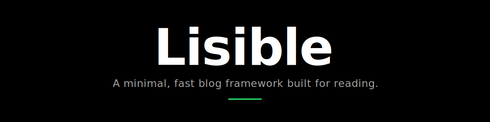

<div align="center">



# Lisible Documentation

Official, bilingual documentation for the Lisible framework. Built from the Organique variant as a standalone Astro documentation site.

</div>

## What this repository contains

- 19 French MDX chapters and 19 mirrored English MDX chapters;
- stable landing pages at `/fr/` and `/en/`, plus the adaptive `x-default` entry at `/`, with documentation under `/docs/` and `/en/docs/`;
- a full-screen, zero-refresh previewer at `/preview/` and `/en/preview/` for all six Lisible variants and their live settings;
- a category-based left navigation and per-page table of contents;
- Pagefind full-text search and command palette;
- Astro view transitions, dark/light themes and a reader-controlled accent;
- MDX by default, including Markdown, tabs, steps, spoilers, callouts, footnotes, KaTeX and interactive Mermaid diagrams;
- canonical URLs, hreflang, sitemap, robots, JSON-LD and `llms.txt` exports;
- automated content parity and internal-link validation.

This is documentation, not a blog. Blog routes under `/_previews/` are isolated, noindex build snapshots used only by the interactive previewer.

## Run locally

```bash
bun install
bun run dev
```

The first development start builds the six preview snapshots and can take a few minutes. Later runs reuse `.cache/lisible-previews/` when the synchronized sources have not changed. Pagefind generates its full-text index during a production build.

```bash
bun run check:all
bun run preview
```

## Content structure

```text
src/content/docs/
├─ fr/
│  ├─ discover/
│  ├─ getting-started/
│  ├─ authoring/
│  ├─ features/
│  ├─ customize/
│  ├─ operations/
│  └─ reference/
└─ en/
   └─ same structure and filenames
```

Every page uses this frontmatter:

```yaml
---
title: "Page title"
description: "Standalone description used for SEO and search."
category: discover
order: 0
badge: "Optional"
draft: false
---
```

The French and English files must share the same relative path and frontmatter keys. `bun run check:content` enforces that contract and validates internal documentation links.

## Architecture

- `src/components/LandingPage.astro` owns the bilingual landing and its link to the dedicated previewer.
- `src/components/PreviewerPage.astro` and `src/components/PreviewerApp.tsx` own the full-screen previewer shell, controls, URL state and seamless iframe swapping.
- `scripts/build-previews.ts` builds the six noindex snapshots from `vendor/lisible/`, with a content-addressed cache.
- `vendor/lisible/` is an automated mirror of `versions/` and `shared/` from the exact synchronized Lisible commit; do not edit it manually.
- `src/components/SeoMeta.astro` owns canonical, hreflang, OpenGraph and Twitter metadata.
- `src/layouts/DocsLayout.astro` owns metadata and the three-column documentation shell.
- `src/components/DocsSidebar.astro` builds the category journey from the content collection.
- `src/components/DocsSearch.astro` owns Pagefind and command actions.
- `src/config/docs.ts` owns category ordering and translated category labels.
- `src/i18n/ui.ts` owns all documentation interface strings.
- `src/lib/docs.ts` owns collection queries, URLs, translations and adjacent pages.
- `src/content/docs/` is the only documentation content source.
- `bun run generate:og` rebuilds the six localized 1200×630 social previews.

## Preview source synchronization

Changes under `versions/` or `shared/` in `didntchooseaname/lisible` dispatch `sync-lisible.yml` in this repository with the exact source SHA. The receiving workflow checks out that immutable revision, preserves symlinks while mirroring both directories, records it in `vendor/lisible/source.json`, then commits only when the mirror changed. Configure `LISIBLE_DOCS_ACTIONS_TOKEN` in the Lisible repository with permission to dispatch Actions in `lisible-docs`.

Use `bun run build:previews` to rebuild only the snapshots, or `bun run build:docs` to build only the documentation shell. `bun run check:all` validates content, builds both layers, and checks the complete output.

Set the public origin in `src/site.config.ts` before deployment. The per-page contribution link targets `https://github.com/didntchooseaname/lisible-docs/edit/main/src/content/docs/<locale>/<page>.mdx`, so a signed-in GitHub user can edit the source and propose a pull request.

## License

MIT. See [LICENSE](LICENSE).
