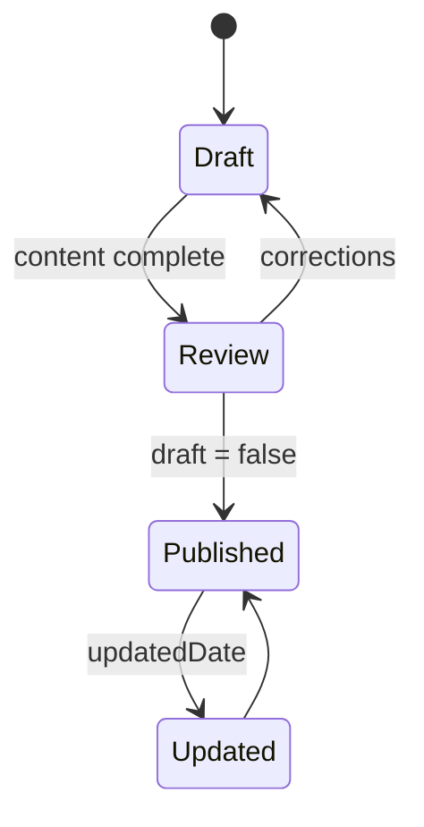

Posts live in one shared collection. The directory prefix determines the locale and the filename determines the public slug.

```text
shared/content/blog/
├─ fr/
│  └─ guide-astro.mdx
└─ en/
   └─ guide-astro.mdx
```

Those files produce `/blog/guide-astro` and `/en/blog/guide-astro`. Matching basenames let the language switcher connect translations.

MDX is the global default format. It accepts all Markdown syntax and can import the components documented in [MDX components](/en/docs/authoring/mdx/). The scaffolder’s `--markdown` option remains available when you deliberately want a component-free `.md` file.

## Minimal frontmatter

```yaml
---
title: "Understanding Astro islands"
description: "A practical guide to hydrating only interactive components."
pubDate: 2026-07-19
tags: ["astro", "performance"]
draft: true
---
```

## Publishing lifecycle



Drafts are visible during development and excluded from production, RSS, sitemap, tags and Pagefind.

## Editorial rules

- a precise title no longer than 70 characters;
- a standalone description useful in search results;
- an ISO date without time when time has no editorial meaning;
- stable, limited and reusable tags;
- an editorial translation, never an unreviewed automatic duplicate.

:::important[Single source]
Do not add posts under `versions/<variant>/src/content`. Every variant reads `shared/content/blog`, the exclusive content owner.
:::

## Sorting and URLs

Lists sort by descending `pubDate`. The slug comes from the relative path: keep names lowercase, hyphenated and free of ambiguous characters.
