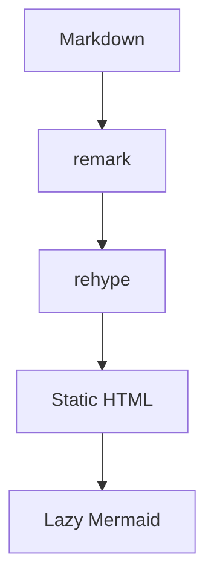

Lisible supports standard Markdown, GFM and several extensions designed for technical writing. Rendering behavior matches across variants even when styling changes. For real interactions, continue with [MDX components](/en/docs/authoring/mdx/).

## Common syntax

| Need | Syntax |
| --- | --- |
| emphasis | `**important**`, `*nuanced*` |
| inline code | `` `const value = 1` `` |
| task | `- [x] published` |
| footnote | `[^1]` then `[^1]: detail` |
| details | `<details><summary>…` |

## Callouts

Available variants are `note`, `tip`, `important`, `warning` and `caution`.
The outline uses the same `--radius-lg` token as link previews and GitHub cards, keeping all three surfaces consistent across the six themes.

```markdown
:::warning[Before deploying]
Run the build and link checks.
:::
```

:::warning[Before deploying]
Run the build and link checks.
:::

## Rich code

Expressive Code adds filenames, line numbers, copy controls, terminal frames and collapsible sections.

```ts title="src/lib/example.ts" {2} ins={3}
export function greet(name: string) {
  const safeName = name.trim() || "reader";
  return `Hello, ${safeName}`;
}
```

## Mathematics

Inline formulas use `$E = mc^2$`. A block is wrapped in double dollars:

$$
L = -\sum_{i=1}^{n} y_i \log(\hat{y}_i)
$$

## Mermaid

A `mermaid` block becomes an interactive diagram with zoom, pan, source copy and theme synchronization.



:::caution[Mermaid block]
Do not wrap Mermaid in an MDX code component. Use a direct `mermaid` fence so the plugin can exclude it from Expressive Code rendering.
:::
