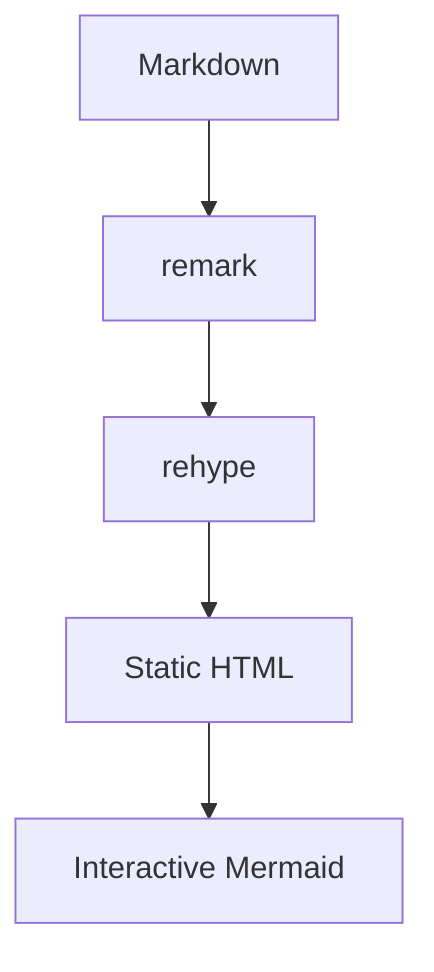

Lisible supports standard Markdown, GFM and several extensions designed for technical writing. Every example below first shows the code to write, followed by its actual rendering. Behavior matches across all six variants even when their styling changes. For real interactions, continue with [MDX components](/en/docs/authoring/mdx/).

## Headings and paragraphs

Use a single level-one title in frontmatter through `title`. Start the article body at `##` for main sections, then move down without skipping a level. Level-two through level-four headings automatically receive a copyable anchor.

**Code**

```markdown
#### An example heading

A paragraph remains one sequence of lines without a blank line.
A blank line starts a new paragraph.
```

**Rendered output**

#### An example heading

A paragraph remains one sequence of lines without a blank line.
A blank line starts a new paragraph.

## Inline formatting

Use emphasis to structure a sentence, not as a replacement for headings. GFM adds strikethrough text. Inline code suits short commands, filenames and identifiers. The HTML `mark` and `kbd` elements are accepted in MDX for highlighting and keyboard keys.

**Code**

```markdown
Text can be **important**, *nuanced*, ~~obsolete~~ or contain `const value = 1`.

Press <kbd>Ctrl</kbd> + <kbd>K</kbd> to open <mark>search</mark>.
```

**Rendered output**

Text can be **important**, *nuanced*, ~~obsolete~~ or contain `const value = 1`.

Press <kbd>Ctrl</kbd> + <kbd>K</kbd> to open <mark>search</mark>.

## Links

Link text should describe its destination. Use a route starting with `/` for an internal page and an absolute URL for an external website. An optional title can add hover context but does not replace descriptive link text.

**Code**

```markdown
Read the [content model](/en/docs/authoring/content/) or the [Astro documentation](https://docs.astro.build/ "Official Astro documentation").
```

**Rendered output**

Read the [content model](/en/docs/authoring/content/) or the [Astro documentation](https://docs.astro.build/ "Official Astro documentation").

## Images

Put shared files in `public/images`, then reference them from the site root. Alternative text describes the information carried by the image; leave it empty only for a strictly decorative image. The quoted title is optional.

**Code**

```markdown

```

**Rendered output**


## Lists

Markdown supports unordered, ordered and nested lists. GFM adds tasks through `- [ ]` and `- [x]`; rendered checkboxes are informational and do not modify the source file.

**Code**

```markdown
- Write the draft
  - Add examples
- Review the content

1. Build the site
2. Check the links

- [x] Documentation written
- [ ] Review complete
```

**Rendered output**

- Write the draft
  - Add examples
- Review the content

1. Build the site
2. Check the links

- [x] Documentation written
- [ ] Review complete

## Blockquotes

Prefix every quoted paragraph with `>`. A nested quote uses `>>`. Add the source in the prose or through a link: Markdown cannot infer it.

**Code**

```markdown
> Performance is an editorial feature.
>
> Lisible team
```

**Rendered output**

> Performance is an editorial feature.
>
> Lisible team

## Tables

The second line defines each column’s alignment: `:---` for left, `:---:` for center and `---:` for right. Wide tables become horizontally scrollable on small screens.

**Code**

```markdown
| Variant | Use | Posts |
| :--- | :---: | ---: |
| Organique | Editorial | 12 |
| Terminal | Technical | 8 |
```

**Rendered output**

| Variant | Use | Posts |
| :--- | :---: | ---: |
| Organique | Editorial | 12 |
| Terminal | Technical | 8 |

## Footnotes

A `[^id]` reference points to a definition with the same identifier. Definitions can stay near their source paragraph; the renderer gathers them at the end of the page and adds return links automatically.

**Code**

```markdown
Islands reduce the JavaScript sent to the browser.[^islands]

[^islands]: Astro hydrates only components marked with a client directive.
```

**Rendered output**

Islands reduce the JavaScript sent to the browser.[^islands]

[^islands]: Astro hydrates only components marked with a client directive.

## Collapsible details

The native HTML `details` element hides non-essential supporting content. Its `summary` should clearly announce what will be revealed. Add `open` to display the content on initial load.

**Code**

```html
<details>
  <summary>Show the complete command</summary>

  Run `bun run check:all` before deployment.
</details>
```

**Rendered output**

<details>
  <summary>Show the complete command</summary>

  Run `bun run check:all` before deployment.
</details>

## Horizontal rule

Three hyphens on their own line create a thematic break. Reserve it for significant topic changes; headings are sufficient in most sections.

**Code**

```markdown
End of the first part.

---

Start of the next part.
```

**Rendered output**

End of the first part.

---

Start of the next part.

## Callouts

A callout highlights information that deserves a specific level of attention. Available variants are `note`, `tip`, `important`, `warning` and `caution`. Text in brackets replaces the translated default title.

| Variant | Recommended use |
| --- | --- |
| `note` | useful context or clarification |
| `tip` | optional advice that makes a task easier |
| `important` | information required for success |
| `warning` | recoverable risk or unexpected behavior |
| `caution` | data loss, security or hard-to-reverse action |

**Code**

```markdown
:::note[Context]
Drafts remain visible during development.
:::

:::tip[Save time]
Run checks before pushing.
:::

:::important[Required configuration]
Set the public URL before building.
:::

:::warning[Before deploying]
Check internal links.
:::

:::caution[Destructive action]
Back up data before a migration.
:::
```

**Rendered output**

:::note[Context]
Drafts remain visible during development.
:::

:::tip[Save time]
Run checks before pushing.
:::

:::important[Required configuration]
Set the public URL before building.
:::

:::warning[Before deploying]
Check internal links.
:::

:::caution[Destructive action]
Back up data before a migration.
:::

### Collapsible callout

Add the `{collapse}` attribute after the title to turn the callout into a native collapsible region. Its content remains in the page and must therefore never contain a secret.

**Code**

```markdown
:::note[Optional details]{collapse}
This explanation can be opened on demand.
:::
```

**Rendered output**

:::note[Optional details]{collapse}
This explanation can be opened on demand.
:::

## Expressive Code blocks

Expressive Code provides Shiki highlighting, copy controls, a language badge, file and terminal frames, line numbers, word wrapping, text and line markers, and collapsible code sections. Always place the language immediately after the opening three backticks.

| Metadata | Effect |
| --- | --- |
| `title="src/file.ts"` | displays a file tab or terminal title |
| `frame="code"` / `"terminal"` / `"none"` / `"auto"` | forces or disables the frame |
| `showLineNumbers=false` | hides numbers, which are already hidden by default in terminals |
| `startLineNumber=40` | starts visual numbering at 40 |
| `wrap=true` | wraps long lines instead of adding horizontal scrolling |
| `preserveIndent=false` and `hangingIndent=2` | control indentation of wrapped lines |
| `{2,5-7}` or `mark={2,5-7}` | highlights multiple lines and ranges without change semantics |
| `ins={3-4}` / `del={8}` | marks inserted or deleted lines |
| `collapse={1-4,10-12}` | hides one or more ranges until they are expanded |

### Lines, ranges and labels

A block can combine neutral highlights, additions and deletions. Selectors accept one line, comma-separated lines and inclusive ranges. Text before `:` adds a visible label.

**Code**

~~~markdown
```ts title="src/users.ts" {2,8-9} ins={"Added":4-5} del={"Removed":7}
interface User {
  id: string;
  name: string;
  plan: "free" | "pro";
  lastLogin: Date;
}
const legacyUser = loadLegacyUser();
export function displayName(user: User) {
  return user.name.trim();
}
```
~~~

**Rendered output**

```ts title="src/users.ts" {2,8-9} ins={"Added":4-5} del={"Removed":7}
interface User {
  id: string;
  name: string;
  plan: "free" | "pro";
  lastLogin: Date;
}
const legacyUser = loadLegacyUser();
export function displayName(user: User) {
  return user.name.trim();
}
```

### Inline markers

A quoted string highlights all its occurrences. Prefix it with `ins=` or `del=` to give it inserted or deleted meaning. A `/.../` expression accepts regular expressions; when it contains a capture group, only the captured part is marked.

**Code**

~~~markdown
```ts "user.name" ins="cache.get" del="legacyToken" /user(Id|Name)/
const userId = request.params.id;
const legacyToken = request.headers.token;
const cached = cache.get(userId);
return user.name ?? cached;
```
~~~

**Rendered output**

```ts "user.name" ins="cache.get" del="legacyToken" /user(Id|Name)/
const userId = request.params.id;
const legacyToken = request.headers.token;
const cached = cache.get(userId);
return user.name ?? cached;
```

### Diff with language highlighting

The `diff` language interprets `+` and `-` as additions and deletions. Add `lang="ts"` to keep TypeScript highlighting; alignment whitespace before unchanged lines is removed in the rendered block.

**Code**

~~~markdown
```diff lang="ts" title="src/config.ts"
  export const config = {
-   locale: "fr",
+   locale: "en",
    trailingSlash: true,
  };
```
~~~

**Rendered output**

```diff lang="ts" title="src/config.ts"
  export const config = {
-   locale: "fr",
+   locale: "en",
    trailingSlash: true,
  };
```

### Collapsible code sections

`collapse` accepts multiple ranges. The project uses `collapseStyle=collapsible-auto` by default: the summary remains available after expansion and is placed on the most logical side of the range. Other values are `github` (one-way expansion), `collapsible-start` (summary first) and `collapsible-end` (summary last). Add `collapsePreserveIndent=false` to align the summary to the left.

**Code**

~~~markdown
```ts title="src/server.ts" collapse={1-4,8-10} collapseStyle=collapsible-auto
import { logger } from "./logger";
import { metrics } from "./metrics";
const app = createApp();
app.use(logger, metrics);
app.get("/health", () => {
  return new Response("ok");
});
app.listen(4321);
console.log("ready");
process.on("SIGTERM", shutdown);
```
~~~

**Rendered output**

```ts title="src/server.ts" collapse={1-4,8-10} collapseStyle=collapsible-auto
import { logger } from "./logger";
import { metrics } from "./metrics";
const app = createApp();
app.use(logger, metrics);
app.get("/health", () => {
  return new Response("ok");
});
app.listen(4321);
console.log("ready");
process.on("SIGTERM", shutdown);
```

### Frames, numbering and wrapping

`title` automatically creates an editor frame for a file. Shell languages use a terminal; `frame="none"` suits isolated commands. `startLineNumber` changes displayed numbers only: markers still count from the first source line.

**Code**

~~~markdown
```ts title="src/config.ts" startLineNumber=40 wrap=true preserveIndent=true hangingIndent=2 {2}
export const description =
  "A deliberately long line that preserves its indentation when it wraps inside a narrow content column.";
```

```bash frame="none" showLineNumbers=false
bun run check:all
```
~~~

**Rendered output**

```ts title="src/config.ts" startLineNumber=40 wrap=true preserveIndent=true hangingIndent=2 {2}
export const description =
  "A deliberately long line that preserves its indentation when it wraps inside a narrow content column.";
```

```bash frame="none" showLineNumbers=false
bun run check:all
```

References: [text and line markers](https://expressive-code.com/key-features/text-markers/), [frames](https://expressive-code.com/key-features/frames/), [line numbers](https://expressive-code.com/plugins/line-numbers/), [word wrap](https://expressive-code.com/key-features/word-wrap/) and [collapsible sections](https://expressive-code.com/plugins/collapsible-sections/).

## Mathematics

KaTeX renders LaTeX expressions. A formula between two `$` delimiters stays inline; a block wrapped in `$$` is centered and separated from the paragraph. Use LaTeX commands supported by KaTeX.

**Code**

```markdown
The relation $E = mc^2$ is rendered inside the sentence.

$$
L = -\sum_{i=1}^{n} y_i \log(\hat{y}_i)
$$
```

**Rendered output**

The relation $E = mc^2$ is rendered inside the sentence.

$$
L = -\sum_{i=1}^{n} y_i \log(\hat{y}_i)
$$

## Mermaid

A `mermaid` fence becomes an interactive diagram. Its toolbar provides zoom, pan, reset, source copy and full-screen controls; colors synchronize with the light or dark theme. Full screen uses the browser API when available and a viewport overlay fallback otherwise. Exit with the toolbar button or <kbd>Escape</kbd>. The content itself follows Mermaid syntax.

**Code**

~~~markdown

~~~

**Rendered output**


:::caution[Mermaid block]
Use a direct `mermaid` fence. Do not wrap it in an MDX code component: the plugin must recognize it before Expressive Code rendering.
:::
