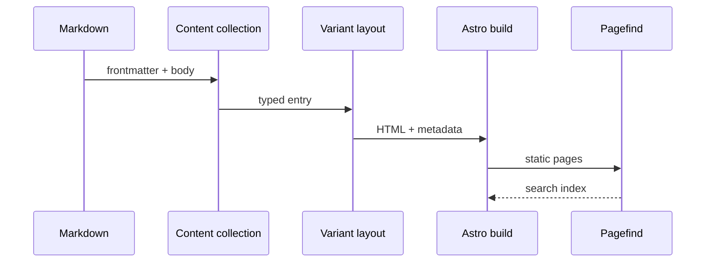

The architecture strictly separates **shared behavior** from **visual expression**. This rule prevents SEO, i18n or editorial fixes from being repeated six times.


## Directory tree

```text title="lisible/"
lisible/
├─ lisible.config.json
├─ package.json
├─ scripts/
├─ shared/
│  ├─ site.config.ts
│  ├─ features.ts
│  ├─ variants.ts
│  ├─ assets/
│  ├─ components/
│  ├─ content/
│  ├─ markdown/
│  ├─ preview/
│  ├─ routes/
│  ├─ scripts/
│  └─ public/
└─ versions/
   ├─ _core/
   ├─ motion-primitives/
   ├─ cult-ui/
   ├─ aceternity/
   ├─ reactbits/
   ├─ organique/
   └─ h4x0r/
```

## Responsibilities

| Surface | Owner | Examples |
| --- | --- | --- |
| Content | `shared/content/` | posts, schema, images |
| Identity | `shared/site.config.ts` | title, URL, author, repository |
| Capabilities | `shared/features.ts` | search, series, comments |
| Shared UI | `shared/components/` | appearance, preview bridge, profile hero, file tree |
| Browser runtime | `shared/scripts/` | locale, cards, diagram full screen |
| Preview contract | `shared/preview/` | build base, settings protocol, frame navigation |
| Shared routes | `shared/routes/` | home, blog, tags, RSS |
| Design | `versions/*/src/` | layouts, components, animation |
| Orchestration | `scripts/` | init, global preview, checks |

:::warning[Prevent drift]
A feature visible in every variant should not be implemented independently without a shared contract. Start with the owning schema, helpers and routes, then adapt presentation.
:::

## Post flow



## The role of `_core`

`versions/_core` is the functional reference. The six public variants may use different components, but they must preserve the shared route baseline, data, error states and accessibility requirements.

A variant may add a showcase route when it stays additive and ships a complete FR/EN pair. Organique’s Certifications and Friends pages follow that rule: they do not replace Home, Blog, Tags, Archives, Series or About.

## Preview boundary

`PreviewBridge.astro` and `shared/preview/` are inert in a normal Lisible build. The documentation builder enables them with `LISIBLE_PREVIEW=1`, assigns each variant an isolated `/_previews/<variant>/` base and exchanges validated settings and navigation messages with the parent previewer. This keeps preview-only `noindex` metadata, content switches and URL rewriting out of deployed reader sites.

[Initial configuration](/en/docs/getting-started/configuration/) describes shared surfaces and [Themes and variants](/en/docs/customize/themes-variants/) formalizes the presentation contract.

## Imports and aliases

In regular Astro source, `@/*` points to `src/*` and `@shared/*` to `shared/*`. Shared MDX components therefore use imports such as `@shared/components/ui/file-tree`. Modules loaded directly by Astro configuration use the Node package-import aliases `#src/*` and `#shared/*`, which are resolved before TypeScript aliases are available. The local `astro.config.ts` boundary may still use `./` imports, but source modules never navigate upward with `../`.
