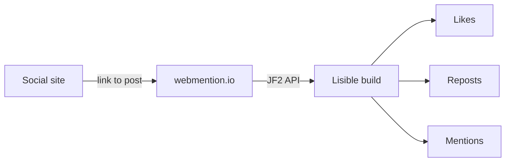

Lisible separates **outbound sharing** from **inbound reactions**. Social buttons use simple intent URLs; comments and webmentions are optional.

## Shipped local preview

By default, `demoPlaceholders: true` displays a bilingual, network-free preview on every post: reactions from `alice@mastodon.social` and `sam@bsky.app`, Giscus and Bluesky comments, and `@example.com` addresses. The `comments` and `webmentions` flags stay disabled until their live identifiers are configured. This mode makes every surface visible immediately after cloning without third-party requests or errors.

## Social sharing

Actions cover X, Bluesky, LinkedIn, Mastodon and link copying. No third-party SDK is loaded. For Mastodon, the selected instance can be remembered locally.

In the shipped demo, the GitHub card and GitHub icon in all six variants target `https://github.com/didntchooseaname/lisible`. The equivalent surfaces in this documentation target `https://github.com/didntchooseaname/lisible-docs`.

```ts
const intent = new URL("https://bsky.app/intent/compose");
intent.searchParams.set("text", `${title} ${url}`);
```

## Giscus

Giscus turns a GitHub discussion into comments. Fill the four values provided by its configurator:

```ts
giscus: {
  repo: "owner/repository",
  repoId: "R_...",
  category: "Comments",
  categoryId: "DIC_...",
}
```

The script loads lazily when the section becomes visible and receives the current theme.

## Bluesky replies

The Bluesky provider uses the root post’s `at://` URI. A value may be global or specific to a post through `bluesky` frontmatter.

## Webmentions

webmention.io aggregates likes, reposts and mentions pointing to the canonical URL. The configured domain must match the actual registered public domain.[^wm-domain]



:::caution[Explicit failure]
An enabled but partially configured integration should stop the build. Disable the flag or provide complete configuration; do not publish a broken component.
:::

## Privacy and resilience

- no permanent social SDK;
- `rel="noopener noreferrer"` on external links;
- timeouts on build-time calls;
- empty fallback when a remote provider is temporarily unavailable;
- no reader email address in HTML.

See [Initial configuration](/en/docs/getting-started/configuration/) for value locations and [Quality and accessibility](/en/docs/operations/quality/) for checks.

[^wm-domain]: webmention.io associates reactions with an exact target URL; protocol, domain and trailing slash must remain consistent.
