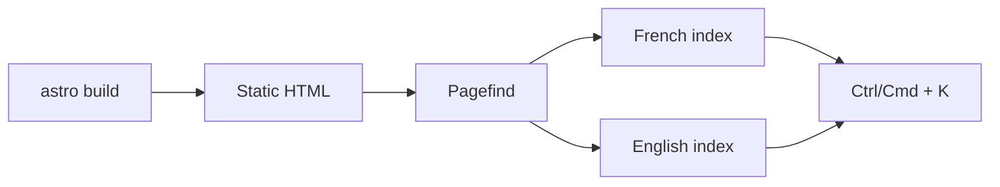

Lisible combines static multi-page HTML with lightweight client navigation. Links remain standard and work without JavaScript; `ClientRouter` adds transitions and preserves selected state.[^astro-router]

## Pagefind

Pagefind analyzes `dist/` after Astro generation. The index is segmented by language through each page’s `<html lang>` attribute.



During development the index does not exist yet. The local Vite plugin provides a fallback module so `bun run dev` does not fail and the palette keeps its actions.

## Command palette

The palette brings together:

- full-text search;
- theme and language switching;
- accent reset;
- page URL copying;
- shortcuts to Blog, Tags, Archives, Series, About and RSS.

It supports arrow keys, <kbd>Enter</kbd> and <kbd>Escape</kbd>.

## Astro transitions

`<ClientRouter />` intercepts internal links. Any script that depends on the DOM must reinitialize on `astro:page-load`, emitted on initial display and after every navigation.[^lifecycle]

```ts
document.addEventListener("astro:page-load", initFeature);
document.addEventListener("astro:before-swap", cleanupFeature);
```

:::warning[Persistent state]
Use `transition:persist` only for state that truly needs to survive. An open modal or observer tied to the old page must be closed before the swap.
:::

## Editorial navigation

Pagination limits list size. Tags provide a thematic path, archives a chronological path and series an ordered path. `Archives` stays in every variant’s top navigation. `Series` appears there only when at least one published post in the locale defines `series`; neither link is placed in the footer. The `/series/` index then exposes the available reading paths. Read [Images, tags and series](/en/docs/authoring/media-taxonomy/) for the associated frontmatter.

## References

- [Astro view transitions guide](https://docs.astro.build/en/guides/view-transitions/)
- [`astro:transitions` API](https://docs.astro.build/en/reference/modules/astro-transitions/)
- [Pagefind configuration](https://pagefind.app/docs/)

[^astro-router]: Astro keeps real pages and adds an optional client router; content is still served as static HTML.
[^lifecycle]: Bundled module scripts do not automatically execute again after each client navigation.
