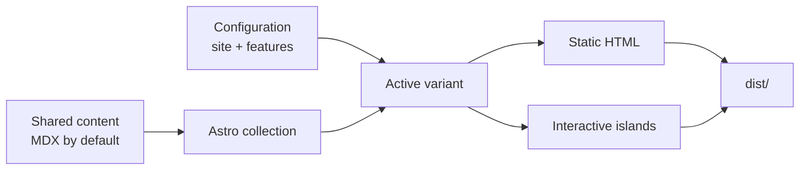

Lisible is a static blog framework built with Astro. It combines one audited functional core, six interchangeable visual experiences and a bilingual editorial pipeline. Content stays unique: switching variants never duplicates posts or configuration.

:::tip[The promise]
One clone, one initialization command, then a fast, accessible, indexable site ready for customization.
:::

## What Lisible provides

- static output with very little reader-side JavaScript;
- six visual variants that share the same contracts;
- French and English MDX content by default, including all Markdown features;
- Pagefind, RSS, sitemap, OpenGraph, JSON-LD and text exports;
- callouts, KaTeX formulas, Mermaid and draw.io diagrams;
- tags, archives, series, drafts, covers and pinned posts;
- reload-free navigation with Astro transitions;
- quality checks for links, assets and builds.

## Mental model

The `shared/` directory owns common data. The `versions/<variant>/` directory owns presentation. Root scripts select the variant, then delegate `dev`, `build` and `preview` to the matching package.

## Recommended path

1. Read [Architecture](/en/docs/discover/architecture/) to learn where each change belongs.
2. Follow [Installation](/en/docs/getting-started/installation/) and [Configuration](/en/docs/getting-started/configuration/).
3. Review [Content](/en/docs/authoring/content/), [Markdown](/en/docs/authoring/markdown/) and [MDX](/en/docs/authoring/mdx/) before publishing.
4. Enable or disable capabilities in `shared/features.ts`.
5. Finish with [Quality](/en/docs/operations/quality/), [Build and deployment](/en/docs/operations/build-deploy/), then [Troubleshooting](/en/docs/operations/troubleshooting/).

:::important[Bilingual documentation]
Every French page has an English mirror at the same logical location. Code examples remain identical, while explanations and labels are fully translated.
:::

## Scope

Lisible favors simple Git-based authoring. It does not ship a CMS, analytics or an email service. Those choices reduce initial cost and maintenance surface while keeping integrations possible when needed.
