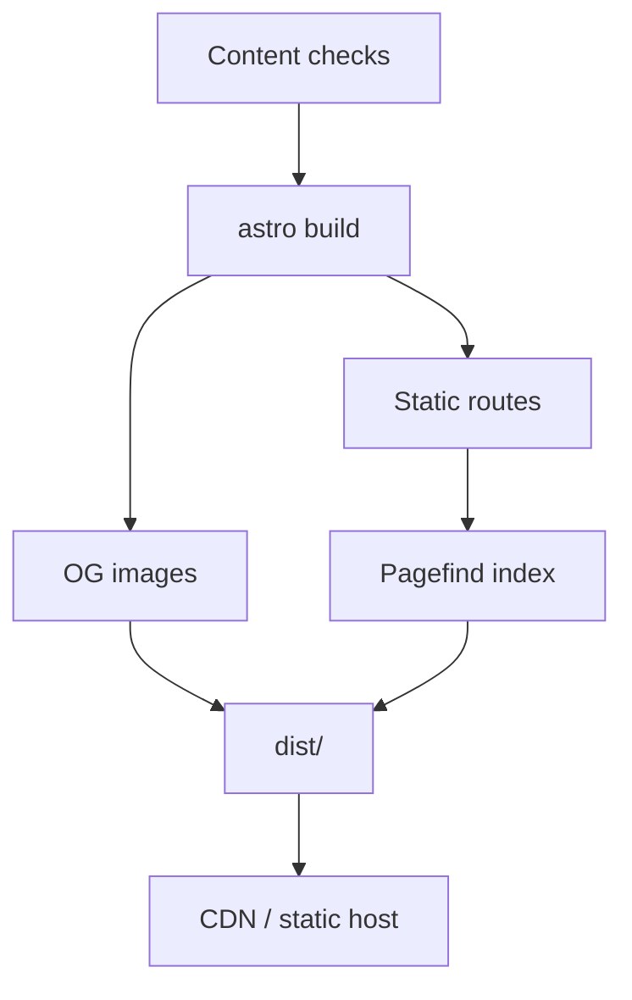

Lisible produces a standalone `dist/` directory. No Node or Bun server is required in production: a static host or CDN is enough.[^static-output]

## Reference build

```bash
bun run build
```

The command validates content, generates French and English routes, OpenGraph images, sitemap, feeds, Markdown exports and finally the Pagefind index.


```mermaid
flowchart TD
  Q[Content checks] --> A[astro build]
  A --> R[Static routes]
  A --> O[OG images]
  R --> P[Pagefind index]
  O --> D[dist/]
  P --> D
  D --> C[CDN / static host]
```

## Production variables

Before building, verify in `lisible.config.json`:

- `site.url` with the final domain;
- the `repo` object for edit links;
- public Giscus, Bluesky or webmention.io configuration under `integrations`;
- secrets injected by the environment and never written to client code;
- the selected `variant`, or a `LISIBLE_VARIANT` environment variable on the platform to override it without editing the file.

## Hosting strategies

| Platform | Output | Rewrites |
| --- | --- | --- |
| GitHub Pages | `dist/` | possible base path |
| Cloudflare Pages | `dist/` | none for generated routes |
| Netlify | `dist/` | static 404 page |
| Vercel | `dist/` | static project |
| Nginx/Caddy | `dist/` files | 404 fallback, compression |

## One-click deployment

The root README displays **Deploy with Vercel** and **Deploy to Netlify** side by side; `vercel.json` and `netlify.toml` preconfigure both. Import the repository at its root: every platform configuration builds the variant selected in `lisible.config.json` (or by `LISIBLE_VARIANT`) and publishes the mirrored `dist/` directory, without manual dashboard configuration.

Railpack auto-detects `railpack.json` and `Staticfile`, Nixpacks auto-detects `nixpacks.toml`, and the platform-provided `PORT` is used automatically. The runtime tools are version-pinned, Nixpacks checksum-verifies every downloaded Node, Bun and Caddy artifact, and only the compiled site and its Caddy runtime reach the final image: it serves static routes directly, compresses responses, caches fingerprinted assets for one year and renders the project 404 page for unknown routes.

:::important[Do not publish the whole repository]
The deployable artifact is `dist/`. `node_modules`, `.astro`, card caches and sources do not belong on the static server.
:::

## Recommended headers

- long immutable cache for `/_astro/*`;
- short cache for HTML, RSS, sitemap and Pagefind;
- a `Content-Security-Policy` matching enabled integrations;
- Brotli or gzip compression;
- `X-Content-Type-Options: nosniff` and a referrer policy.

## Post-deployment acceptance

1. Open a French page and its English mirror.
2. Verify canonical, hreflang and OG image.
3. Test <kbd>Ctrl</kbd>/<kbd>Cmd</kbd> + <kbd>K</kbd>.
4. Navigate without a full reload.
5. Open RSS, sitemap, `robots.txt` and `llms.txt`.
6. Test a real 404.

The [Quality and accessibility](/en/docs/operations/quality/) page provides the pre-publish checklist.

## References

- [Astro deployment guide](https://docs.astro.build/en/guides/deploy/)
- [Astro build configuration](https://docs.astro.build/en/reference/configuration-reference/#build-options)

[^static-output]: Static mode is Astro’s default; Lisible makes it explicit to keep the artifact predictable.
