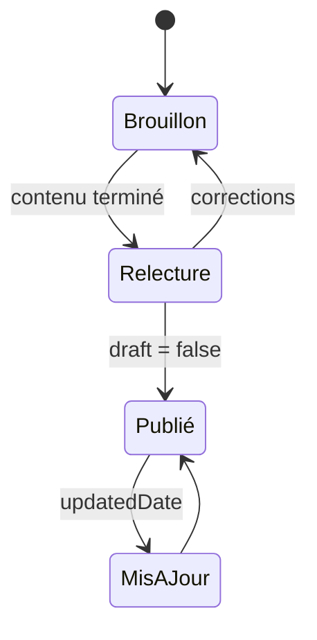

Les articles vivent dans une seule collection partagée. Le préfixe du dossier détermine la locale et le nom de fichier détermine le slug public.

```text
shared/content/blog/
├─ fr/
│  └─ guide-astro.mdx
└─ en/
   └─ guide-astro.mdx
```

Ces deux fichiers produisent `/blog/guide-astro` et `/en/blog/guide-astro`. Le basename identique permet au sélecteur de langue de relier les traductions.

MDX est le format global par défaut. Il accepte toute la syntaxe Markdown et permet d’importer les composants documentés dans [Composants MDX](/docs/authoring/mdx/). L’option `--markdown` du scaffolder reste disponible pour créer volontairement un fichier `.md` sans composants.

## Frontmatter minimal

```yaml
---
title: "Comprendre les îlots Astro"
description: "Un guide pratique pour hydrater uniquement les composants interactifs."
pubDate: 2026-07-19
tags: ["astro", "performance"]
draft: true
---
```

## Cycle de publication



Les brouillons sont visibles en développement et exclus de la production, du RSS, du sitemap, des tags et de Pagefind.

## Règles éditoriales

- un titre précis de 70 caractères au maximum ;
- une description autonome et utile dans les résultats de recherche ;
- une date ISO sans heure lorsque l’heure n’a pas de sens éditorial ;
- des tags stables, peu nombreux et réutilisables ;
- une traduction éditoriale, jamais une simple duplication automatique non relue.

:::important[Source unique]
N’ajoutez pas d’articles dans `versions/<variante>/src/content`. Toutes les variantes lisent `shared/content/blog`, qui est le propriétaire exclusif du contenu.
:::

## Tri et URL

Les listes sont triées par `pubDate` décroissante. Le slug vient du chemin relatif : gardez des noms en minuscules, séparés par des tirets, sans caractères ambigus.
