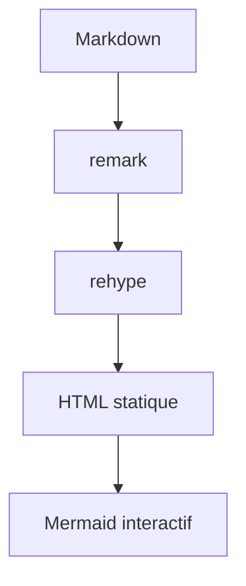

Lisible prend en charge Markdown standard, GFM et plusieurs extensions adaptées aux articles techniques. Chaque exemple ci-dessous présente d’abord le code à écrire, puis son rendu réel. Le comportement reste identique dans les six variantes, même si leur style change. Pour ajouter de vraies interactions, poursuivez avec [Composants MDX](/docs/authoring/mdx/).

## Titres et paragraphes

Utilisez un seul titre de niveau 1 dans le frontmatter avec `title`. Dans le corps de l’article, commencez à `##` pour les grandes sections, puis descendez sans sauter de niveau. Les titres de niveaux 2 à 4 reçoivent automatiquement une ancre copiable.

**Code**

```markdown
#### Un titre d’exemple

Un paragraphe reste une suite de lignes sans ligne vide.
Une ligne vide commence un nouveau paragraphe.
```

**Rendu**

#### Un titre d’exemple

Un paragraphe reste une suite de lignes sans ligne vide.
Une ligne vide commence un nouveau paragraphe.

## Mise en forme inline

L’emphase sert à structurer une phrase, pas à remplacer les titres. GFM ajoute le texte barré. Le code inline convient aux commandes courtes, noms de fichiers et identifiants. Les balises HTML `mark` et `kbd` sont acceptées dans MDX pour un surlignage ou une touche de clavier.

**Code**

```markdown
Un texte peut être **important**, *nuancé*, ~~obsolète~~ ou contenir `const value = 1`.

Appuyez sur <kbd>Ctrl</kbd> + <kbd>K</kbd> pour ouvrir la <mark>recherche</mark>.
```

**Rendu**

Un texte peut être **important**, *nuancé*, ~~obsolète~~ ou contenir `const value = 1`.

Appuyez sur <kbd>Ctrl</kbd> + <kbd>K</kbd> pour ouvrir la <mark>recherche</mark>.

## Liens

Le texte du lien doit décrire sa destination. Utilisez une route commençant par `/` pour une page interne et une URL absolue pour un site externe. Un titre facultatif peut compléter le lien au survol sans remplacer son libellé.

**Code**

```markdown
Consultez [le modèle de contenu](/docs/authoring/content/) ou la [documentation Astro](https://docs.astro.build/ "Documentation officielle Astro").
```

**Rendu**

Consultez [le modèle de contenu](/docs/authoring/content/) ou la [documentation Astro](https://docs.astro.build/ "Documentation officielle Astro").

## Images

Placez les fichiers partagés dans `public/images`, puis référencez-les depuis la racine. Le texte alternatif décrit l’information portée par l’image ; laissez-le vide uniquement pour une image strictement décorative. Le titre entre guillemets est facultatif.

**Code**

```markdown

```

**Rendu**


## Listes

Markdown gère les listes à puces, numérotées et imbriquées. GFM ajoute les tâches avec `- [ ]` et `- [x]` ; les cases rendues sont informatives et ne modifient pas le fichier source.

**Code**

```markdown
- Écrire le brouillon
  - Ajouter les exemples
- Relire le contenu

1. Construire le site
2. Vérifier les liens

- [x] Documentation rédigée
- [ ] Relecture terminée
```

**Rendu**

- Écrire le brouillon
  - Ajouter les exemples
- Relire le contenu

1. Construire le site
2. Vérifier les liens

- [x] Documentation rédigée
- [ ] Relecture terminée

## Citations

Préfixez chaque paragraphe cité avec `>`. Une seconde citation imbriquée utilise `>>`. Ajoutez la source dans le texte ou dans un lien : Markdown ne l’invente pas.

**Code**

```markdown
> La performance est une fonctionnalité éditoriale.
>
> — Équipe Lisible
```

**Rendu**

> La performance est une fonctionnalité éditoriale.
>
> — Équipe Lisible

## Tableaux

La deuxième ligne définit l’alignement de chaque colonne : `:---` à gauche, `:---:` au centre et `---:` à droite. Les tableaux larges deviennent défilables horizontalement sur petit écran.

**Code**

```markdown
| Variante | Usage | Articles |
| :--- | :---: | ---: |
| Organique | Éditorial | 12 |
| Terminal | Technique | 8 |
```

**Rendu**

| Variante | Usage | Articles |
| :--- | :---: | ---: |
| Organique | Éditorial | 12 |
| Terminal | Technique | 8 |

## Notes de bas de page

Une référence `[^id]` pointe vers une définition portant le même identifiant. Les définitions peuvent être placées près du paragraphe source ; le moteur les rassemble automatiquement en fin de page et ajoute les liens de retour.

**Code**

```markdown
Les îlots réduisent le JavaScript envoyé au navigateur.[^islands]

[^islands]: Astro hydrate uniquement les composants marqués par une directive client.
```

**Rendu**

Les îlots réduisent le JavaScript envoyé au navigateur.[^islands]

[^islands]: Astro hydrate uniquement les composants marqués par une directive client.

## Détails repliables

La balise HTML native `details` masque un complément non essentiel. Le `summary` doit annoncer clairement ce qui sera révélé. Ajoutez `open` pour afficher le contenu dès le chargement.

**Code**

```html
<details>
  <summary>Afficher la commande complète</summary>

  Exécutez `bun run check:all` avant le déploiement.
</details>
```

**Rendu**

<details>
  <summary>Afficher la commande complète</summary>

  Exécutez `bun run check:all` avant le déploiement.
</details>

## Séparateur horizontal

Trois tirets seuls sur une ligne créent une séparation thématique. Réservez-la aux changements de sujet importants ; les titres suffisent dans la plupart des sections.

**Code**

```markdown
Fin de la première partie.

---

Début de la partie suivante.
```

**Rendu**

Fin de la première partie.

---

Début de la partie suivante.

## Callouts

Un callout met en avant une information qui mérite un niveau d’attention particulier. Les variantes disponibles sont `note`, `tip`, `important`, `warning` et `caution`. Le texte entre crochets remplace le titre traduit par défaut.

| Variante | Usage recommandé |
| --- | --- |
| `note` | contexte ou précision utile |
| `tip` | conseil facultatif qui facilite une tâche |
| `important` | information indispensable à la réussite |
| `warning` | risque récupérable ou comportement inattendu |
| `caution` | risque de perte, sécurité ou action difficile à annuler |

**Code**

```markdown
:::note[Contexte]
Les brouillons restent visibles en développement.
:::

:::tip[Gain de temps]
Lancez les contrôles avant de pousser.
:::

:::important[Configuration requise]
Définissez l’URL publique avant le build.
:::

:::warning[Avant de déployer]
Vérifiez les liens internes.
:::

:::caution[Action destructive]
Sauvegardez les données avant une migration.
:::
```

**Rendu**

:::note[Contexte]
Les brouillons restent visibles en développement.
:::

:::tip[Gain de temps]
Lancez les contrôles avant de pousser.
:::

:::important[Configuration requise]
Définissez l’URL publique avant le build.
:::

:::warning[Avant de déployer]
Vérifiez les liens internes.
:::

:::caution[Action destructive]
Sauvegardez les données avant une migration.
:::

### Callout repliable

Ajoutez l’attribut `{collapse}` après le titre pour transformer le callout en zone repliable native. Le contenu reste présent dans la page et ne doit donc jamais contenir un secret.

**Code**

```markdown
:::note[Détails facultatifs]{collapse}
Cette explication peut être ouverte à la demande.
:::
```

**Rendu**

:::note[Détails facultatifs]{collapse}
Cette explication peut être ouverte à la demande.
:::

## Blocs Expressive Code

Expressive Code fournit ici la coloration Shiki, le bouton de copie, un badge de langage, les cadres de fichier ou de terminal, les numéros de lignes, le retour à la ligne, les marqueurs de texte et de lignes ainsi que les sections de code repliables. Indiquez toujours le langage juste après les trois accents graves.

| Métadonnée | Effet |
| --- | --- |
| `title="src/file.ts"` | affiche un onglet de fichier ou le titre du terminal |
| `frame="code"` / `"terminal"` / `"none"` / `"auto"` | force ou désactive le cadre |
| `showLineNumbers=false` | masque les numéros, déjà masqués par défaut dans les terminaux |
| `startLineNumber=40` | commence la numérotation visuelle à 40 |
| `wrap=true` | replie les lignes longues au lieu d’ajouter un défilement horizontal |
| `preserveIndent=false` et `hangingIndent=2` | règlent l’indentation des lignes repliées |
| `{2,5-7}` ou `mark={2,5-7}` | surligne plusieurs lignes et plages sans sémantique de modification |
| `ins={3-4}` / `del={8}` | marque des ajouts ou suppressions |
| `collapse={1-4,10-12}` | masque une ou plusieurs plages jusqu’à leur ouverture |

### Lignes, plages et libellés

Un même bloc peut combiner surlignage neutre, ajouts et suppressions. Les sélecteurs acceptent une ligne, plusieurs lignes séparées par des virgules et des plages inclusives. Un texte placé avant `:` ajoute un libellé visible.

**Code**

~~~markdown
```ts title="src/users.ts" {2,8-9} ins={"Ajout":4-5} del={"Suppression":7}
interface User {
  id: string;
  name: string;
  plan: "free" | "pro";
  lastLogin: Date;
}
const legacyUser = loadLegacyUser();
export function displayName(user: User) {
  return user.name.trim();
}
```
~~~

**Rendu**

```ts title="src/users.ts" {2,8-9} ins={"Ajout":4-5} del={"Suppression":7}
interface User {
  id: string;
  name: string;
  plan: "free" | "pro";
  lastLogin: Date;
}
const legacyUser = loadLegacyUser();
export function displayName(user: User) {
  return user.name.trim();
}
```

### Marqueurs dans une ligne

Une chaîne entre guillemets surligne toutes ses occurrences. Préfixez-la avec `ins=` ou `del=` pour lui donner le sens d’un ajout ou d’une suppression. Une expression entre `/.../` accepte les expressions régulières ; avec un groupe capturant, seule la partie capturée est marquée.

**Code**

~~~markdown
```ts "user.name" ins="cache.get" del="legacyToken" /user(Id|Name)/
const userId = request.params.id;
const legacyToken = request.headers.token;
const cached = cache.get(userId);
return user.name ?? cached;
```
~~~

**Rendu**

```ts "user.name" ins="cache.get" del="legacyToken" /user(Id|Name)/
const userId = request.params.id;
const legacyToken = request.headers.token;
const cached = cache.get(userId);
return user.name ?? cached;
```

### Diff avec coloration du langage

Le langage `diff` interprète `+` et `-` comme des ajouts et suppressions. Ajoutez `lang="ts"` pour conserver la coloration TypeScript ; l’espace d’alignement placé devant les lignes inchangées disparaît au rendu.

**Code**

~~~markdown
```diff lang="ts" title="src/config.ts"
  export const config = {
-   locale: "fr",
+   locale: "en",
    trailingSlash: true,
  };
```
~~~

**Rendu**

```diff lang="ts" title="src/config.ts"
  export const config = {
-   locale: "fr",
+   locale: "en",
    trailingSlash: true,
  };
```

### Sections de code repliables

`collapse` accepte plusieurs plages. Le projet utilise `collapseStyle=collapsible-auto` par défaut : le résumé reste disponible après ouverture et se place du côté le plus logique de la plage. Les autres valeurs sont `github` (ouverture définitive), `collapsible-start` (résumé au début) et `collapsible-end` (résumé à la fin). Ajoutez `collapsePreserveIndent=false` pour aligner le résumé à gauche.

**Code**

~~~markdown
```ts title="src/server.ts" collapse={1-4,8-10} collapseStyle=collapsible-auto
import { logger } from "./logger";
import { metrics } from "./metrics";
const app = createApp();
app.use(logger, metrics);
app.get("/health", () => {
  return new Response("ok");
});
app.listen(4321);
console.log("ready");
process.on("SIGTERM", shutdown);
```
~~~

**Rendu**

```ts title="src/server.ts" collapse={1-4,8-10} collapseStyle=collapsible-auto
import { logger } from "./logger";
import { metrics } from "./metrics";
const app = createApp();
app.use(logger, metrics);
app.get("/health", () => {
  return new Response("ok");
});
app.listen(4321);
console.log("ready");
process.on("SIGTERM", shutdown);
```

### Cadres, numéros et retour à la ligne

`title` crée automatiquement un cadre d’éditeur pour un fichier. Les langages shell utilisent un terminal ; `frame="none"` convient aux commandes isolées. `startLineNumber` change seulement les numéros affichés : les marqueurs continuent de compter depuis la première ligne source.

**Code**

~~~markdown
```ts title="src/config.ts" startLineNumber=40 wrap=true preserveIndent=true hangingIndent=2 {2}
export const description =
  "Une ligne volontairement longue qui conserve son indentation lorsqu’elle revient à la ligne dans une colonne étroite.";
```

```bash frame="none" showLineNumbers=false
bun run check:all
```
~~~

**Rendu**

```ts title="src/config.ts" startLineNumber=40 wrap=true preserveIndent=true hangingIndent=2 {2}
export const description =
  "Une ligne volontairement longue qui conserve son indentation lorsqu’elle revient à la ligne dans une colonne étroite.";
```

```bash frame="none" showLineNumbers=false
bun run check:all
```

Références : [marqueurs de texte et de lignes](https://expressive-code.com/key-features/text-markers/), [cadres](https://expressive-code.com/key-features/frames/), [numéros de lignes](https://expressive-code.com/plugins/line-numbers/), [retour à la ligne](https://expressive-code.com/key-features/word-wrap/) et [sections repliables](https://expressive-code.com/plugins/collapsible-sections/).

## Mathématiques

KaTeX rend les expressions LaTeX. Une formule entre deux `$` reste dans la ligne ; un bloc entouré de `$$` est centré et séparé du paragraphe. Utilisez des commandes LaTeX prises en charge par KaTeX.

**Code**

```markdown
La relation $E = mc^2$ est affichée dans la phrase.

$$
L = -\sum_{i=1}^{n} y_i \log(\hat{y}_i)
$$
```

**Rendu**

La relation $E = mc^2$ est affichée dans la phrase.

$$
L = -\sum_{i=1}^{n} y_i \log(\hat{y}_i)
$$

## Mermaid

Une fence `mermaid` est transformée en diagramme interactif. La barre d’outils permet le zoom, le déplacement, la réinitialisation et la copie de la source ; les couleurs se synchronisent avec le thème clair ou sombre. La syntaxe interne reste celle de Mermaid.

**Code**

~~~markdown

~~~

**Rendu**


:::caution[Bloc Mermaid]
Utilisez directement une fence `mermaid`. Ne l’encadrez pas dans un composant de code MDX : le plugin doit la reconnaître avant le rendu Expressive Code.
:::
