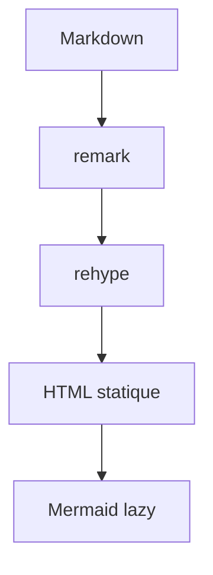

Lisible prend en charge Markdown standard, GFM et plusieurs extensions adaptées aux articles techniques. Le rendu est identique dans toutes les variantes, même si le style change. Pour ajouter de vraies interactions, poursuivez avec [Composants MDX](/docs/authoring/mdx/).

## Syntaxe courante

| Besoin | Syntaxe |
| --- | --- |
| emphase | `**important**`, `*nuancé*` |
| code inline | `` `const value = 1` `` |
| tâche | `- [x] publié` |
| note | `[^1]` puis `[^1]: détail` |
| détails | `<details><summary>…` |

## Callouts

Les variantes disponibles sont `note`, `tip`, `important`, `warning` et `caution`.
Le contour utilise le même token `--radius-lg` que les aperçus de liens et les cartes GitHub : ces trois surfaces restent donc cohérentes dans les six thèmes.

```markdown
:::warning[Avant de déployer]
Exécutez le build et les contrôles de liens.
:::
```

:::warning[Avant de déployer]
Exécutez le build et les contrôles de liens.
:::

## Code enrichi

Expressive Code ajoute le titre de fichier, les numéros de lignes, la copie, les cadres terminal et les sections repliables.

```ts title="src/lib/example.ts" {2} ins={3}
export function greet(name: string) {
  const safeName = name.trim() || "reader";
  return `Hello, ${safeName}`;
}
```

## Mathématiques

Les formules inline utilisent `$E = mc^2$`. Un bloc est entouré de doubles dollars :

$$
L = -\sum_{i=1}^{n} y_i \log(\hat{y}_i)
$$

## Mermaid

Un bloc `mermaid` est transformé en diagramme interactif, avec zoom, déplacement, copie de la source et synchronisation du thème.



:::caution[Bloc Mermaid]
N’encadrez pas Mermaid dans un composant de code MDX. Utilisez directement une fence `mermaid`, afin que le plugin l’exclue du rendu Expressive Code.
:::
