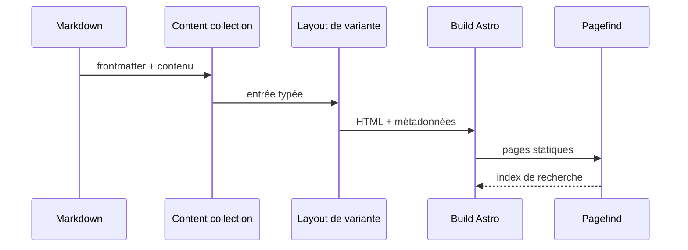

L’architecture sépare strictement **le comportement partagé** de **l’expression visuelle**. Cette règle évite qu’une correction SEO, i18n ou éditoriale doive être répétée six fois.


## Arborescence

```text title="lisible/"
lisible/
├─ lisible.config.json
├─ package.json
├─ scripts/
├─ shared/
│  ├─ site.config.ts
│  ├─ features.ts
│  ├─ variants.ts
│  ├─ content/
│  ├─ markdown/
│  ├─ routes/
│  └─ public/
└─ versions/
   ├─ _core/
   ├─ motion-primitives/
   ├─ cult-ui/
   ├─ aceternity/
   ├─ reactbits/
   ├─ organique/
   └─ h4x0r/
```

## Responsabilités

| Surface | Propriétaire | Exemples |
| --- | --- | --- |
| Contenu | `shared/content/` | articles, schéma, images |
| Identité | `shared/site.config.ts` | titre, URL, auteur, dépôt |
| Capacités | `shared/features.ts` | recherche, séries, commentaires |
| Routes communes | `shared/routes/` | accueil, blog, tags, RSS |
| Design | `versions/*/src/` | layouts, composants, animations |
| Orchestration | `scripts/` | init, preview global, contrôles |

:::warning[Éviter la dérive]
Une fonctionnalité visible dans toutes les variantes ne doit pas être implémentée indépendamment sans contrat partagé. Commencez par le schéma, les helpers et les routes propriétaires, puis adaptez le rendu.
:::

## Flux d’un article



## Le rôle de `_core`

`versions/_core` sert de référence fonctionnelle. Les six variantes publiques peuvent utiliser des composants différents, mais doivent conserver les mêmes routes, données, états d’erreur et exigences d’accessibilité.

La [Configuration initiale](/docs/getting-started/configuration/) décrit les surfaces partagées et [Thèmes et variantes](/docs/customize/themes-variants/) formalise le contrat de présentation.

## Imports et alias

Dans le code source Astro courant, `@/*` pointe vers `src/*` et `@shared/*` vers `shared/*`. Les modules chargés directement par la configuration Astro utilisent les alias d’import de paquet Node `#src/*` et `#shared/*`, résolus avant les alias TypeScript. La frontière locale `astro.config.ts` peut conserver des imports en `./`, mais les modules source ne remontent jamais l’arborescence avec `../`.
