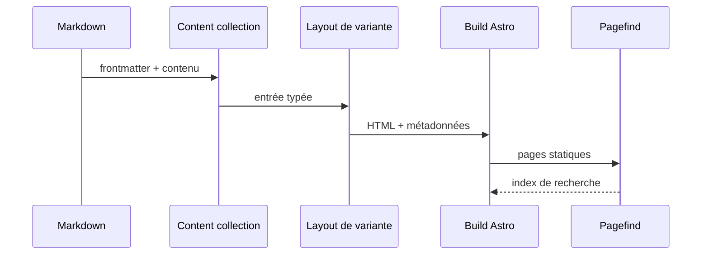

L’architecture sépare strictement **le comportement partagé** de **l’expression visuelle**. Cette règle évite qu’une correction SEO, i18n ou éditoriale doive être répétée six fois.


## Arborescence

```text title="lisible/"
lisible/
├─ lisible.config.json
├─ package.json
├─ scripts/
├─ tests/
├─ e2e/
├─ packages/
│  ├─ lisible/
│  └─ create-lisible/
├─ shared/
│  ├─ config.ts
│  ├─ site.config.ts
│  ├─ features.ts
│  ├─ variants.ts
│  ├─ assets/
│  ├─ components/
│  ├─ content/
│  ├─ integrations/
│  ├─ lib/
│  ├─ markdown/
│  ├─ preview/
│  ├─ routes/
│  ├─ scripts/
│  ├─ print.css
│  └─ public/
└─ versions/
   ├─ _core/
   ├─ motion-primitives/
   ├─ cult-ui/
   ├─ aceternity/
   ├─ reactbits/
   ├─ organique/
   └─ h4x0r/
```

## Responsabilités

| Surface | Propriétaire | Exemples |
| --- | --- | --- |
| Configuration | `lisible.config.json` | variante, identité, flags, intégrations |
| Contenu | `shared/content/` | articles, schéma, images |
| Identité | `shared/site.config.ts` | valeurs dérivées de la configuration |
| Capacités | `shared/features.ts` | flags dérivés de la configuration |
| UI partagée | `shared/components/` | apparence, bridge de preview, hero de profil, arborescence |
| Runtime navigateur | `shared/scripts/` | locale, cartes, plein écran des diagrammes |
| Contrat de preview | `shared/preview/` | base de build, protocole de réglages, navigation de frame |
| Routes communes | `shared/routes/` | accueil, blog, tags, RSS |
| Pipeline de contenu | `shared/lib/` | requêtes sur les articles, formatage, RSS, llms.txt, Open Graph |
| Intégrations de build | `shared/integrations/` | assets KaTeX auto-hébergés |
| Impression | `shared/print.css` | rendu papier et export PDF |
| Design | `versions/*/src/` | layouts, composants, animations |
| Orchestration | `scripts/` | init, preview global, contrôles |
| Tests | `tests/`, `e2e/` | tests unitaires, suite Playwright de bout en bout |
| Scaffolding | `packages/` | les CLIs npm `lisible` et `create-lisible` |

:::warning[Éviter la dérive]
Une fonctionnalité visible dans toutes les variantes ne doit pas être implémentée indépendamment sans contrat partagé. Commencez par le schéma, les helpers et les routes propriétaires, puis adaptez le rendu.
:::

## Flux d’un article


```mermaid
sequenceDiagram
  participant M as Markdown
  participant C as Content collection
  participant L as Layout de variante
  participant B as Build Astro
  participant P as Pagefind
  M->>C: frontmatter + contenu
  C->>L: entrée typée
  L->>B: HTML + métadonnées
  B->>P: pages statiques
  P-->>B: index de recherche
```

## Le rôle de `_core`

`versions/_core` sert de référence fonctionnelle. Les six variantes publiques peuvent utiliser des composants différents, mais doivent conserver le socle commun de routes, les données, les états d’erreur et les exigences d’accessibilité.

Une variante peut ajouter une route de démonstration si elle reste additive et fournit une paire FR/EN complète. Les pages Certifications et Amis d’Organique respectent cette règle : elles ne remplacent ni Accueil, ni Blog, ni Tags, ni Archives, ni Séries, ni À propos.

## Frontière du preview

`PreviewBridge.astro` et `shared/preview/` restent inertes dans un build Lisible normal. Le builder de documentation les active avec `LISIBLE_PREVIEW=1`, attribue à chaque variante une base isolée `/_previews/<variante>/` et échange avec le previewer parent des réglages et messages de navigation validés. Les métadonnées `noindex`, options de contenu et réécritures d’URL propres au preview ne contaminent donc pas les sites lecteurs déployés.

La [Configuration initiale](/docs/getting-started/configuration/) décrit les surfaces partagées et [Thèmes et variantes](/docs/customize/themes-variants/) formalise le contrat de présentation.

## Imports et alias

Le code source Astro utilise deux alias et deux seulement : `@/*` pointe vers `src/*` et `@shared/*` vers `shared/*`. Les composants MDX partagés utilisent donc des imports comme `@shared/components/ui/file-tree`, et les modules source ne remontent jamais l’arborescence avec `../`.

Les modules chargés directement par `astro.config.ts` font exception : la configuration est évaluée avant que les alias soient disponibles, ils utilisent donc des chemins relatifs. C’est le cas des greffons remark et rehype, du badge de langage et des dictionnaires que la configuration importe.

Le dépôt est un workspace Bun couvrant `shared`, `versions/*` et `packages/*`. Le cœur partagé est le paquet `@lisible/shared` ; chaque variante en dépend avec `workspace:*`, et un seul `bun install` à la racine les lie tous. Chaque paquet déclare les dépendances qu’il utilise réellement dans son propre `package.json` plutôt que de compter sur une résolution accidentelle vers la racine.
