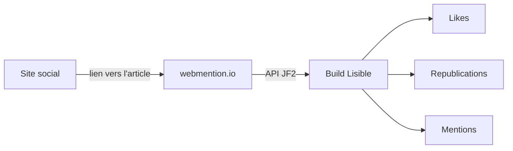

Lisible sépare le **partage sortant** des **réactions entrantes**. Les boutons sociaux fonctionnent avec de simples URLs d’intention ; les commentaires et webmentions sont optionnels.

## Aperçu local livré

Par défaut, `demoPlaceholders: true` affiche sur chaque article un aperçu bilingue sans réseau : réactions de `alice@mastodon.social` et `sam@bsky.app`, commentaires Giscus et Bluesky, et adresses `@example.com`. Les flags `comments` et `webmentions` restent désactivés tant que leurs identifiants réels ne sont pas renseignés. Ce mode rend toutes les surfaces visibles dès le clone sans provoquer de requêtes ou d’erreurs tierces.

## Partage social

Les actions couvrent X, Bluesky, LinkedIn, Mastodon et la copie du lien. Aucun SDK tiers n’est chargé. Pour Mastodon, l’instance choisie peut être mémorisée localement.

Dans la démonstration livrée, la carte GitHub et l’icône GitHub des six variantes pointent vers `https://github.com/didntchooseaname/lisible`. Les mêmes surfaces de cette documentation pointent vers `https://github.com/didntchooseaname/lisible-docs`.

```ts
const intent = new URL("https://bsky.app/intent/compose");
intent.searchParams.set("text", `${title} ${url}`);
```

## Giscus

Giscus transforme une discussion GitHub en commentaires. Renseignez les quatre valeurs fournies par son configurateur :

```ts
giscus: {
  repo: "owner/repository",
  repoId: "R_...",
  category: "Comments",
  categoryId: "DIC_...",
}
```

Le script est chargé paresseusement lorsque la section devient visible et reçoit le thème courant.

## Replies Bluesky

Le provider Bluesky utilise l’URI `at://` du post racine. Une valeur peut être globale ou spécifique à l’article via le frontmatter `bluesky`.

## Webmentions

webmention.io agrège les likes, republications et mentions qui pointent vers l’URL canonique. Le domaine configuré doit correspondre au domaine public réellement enregistré.[^wm-domain]



:::caution[Échec explicite]
Une intégration activée mais partiellement configurée doit arrêter le build. Désactivez le flag ou fournissez une configuration complète ; ne publiez pas un composant cassé.
:::

## Vie privée et résilience

- pas de SDK social permanent ;
- `rel="noopener noreferrer"` sur les liens externes ;
- timeouts sur les appels au build ;
- fallback vide si le fournisseur distant est temporairement indisponible ;
- aucune adresse email de lecteur dans le HTML.

Voir [Configuration initiale](/docs/getting-started/configuration/) pour l’emplacement des valeurs et [Qualité et accessibilité](/docs/operations/quality/) pour les contrôles.

[^wm-domain]: webmention.io associe les réactions à une URL cible exacte ; protocole, domaine et slash final doivent rester cohérents.
