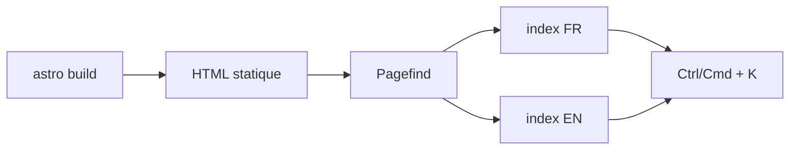

Lisible combine un HTML multipage statique avec une navigation client légère. Les liens restent standards et utilisables sans JavaScript ; `ClientRouter` ajoute les transitions et conserve certains états.[^astro-router]

## Pagefind

Pagefind analyse `dist/` après la génération Astro. L’index est segmenté par langue grâce à l’attribut `<html lang>` de chaque page.



En développement, l’index n’existe pas encore. Le plugin Vite local fournit un module de repli afin que `bun run dev` n’échoue pas et que la palette conserve ses actions.

## Palette de commandes

La palette réunit :

- la recherche plein texte ;
- le changement de thème et de langue ;
- la réinitialisation de l’accent ;
- la copie de l’URL ;
- les raccourcis vers Blog, Tags, Archives, Séries, À propos et RSS.

Elle se pilote au clavier avec les flèches, <kbd>Entrée</kbd> et <kbd>Échap</kbd>.

## Transitions Astro

`<ClientRouter />` intercepte les liens internes. Tout script qui dépend du DOM doit se réinitialiser sur `astro:page-load`, événement émis au premier affichage et après chaque navigation.[^lifecycle]

```ts
document.addEventListener("astro:page-load", initFeature);
document.addEventListener("astro:before-swap", cleanupFeature);
```

:::warning[État persistant]
Utilisez `transition:persist` seulement pour un état qui doit réellement survivre. Une modal ouverte ou un observateur lié à l’ancienne page doit être fermé avant le swap.
:::

## Navigation éditoriale

La pagination limite la taille des listes. Les tags offrent un parcours thématique, les archives un parcours chronologique et les séries un parcours ordonné. `Archives` reste dans la navigation haute de chaque variante. `Séries` y apparaît uniquement lorsqu’au moins un article publié de la locale définit `series`; les deux liens sont absents du footer. L’index `/series/` distribue ensuite les parcours disponibles. Lisez [Images, tags et séries](/docs/authoring/media-taxonomy/) pour le frontmatter associé.

## Références

- [Guide Astro sur les transitions](https://docs.astro.build/en/guides/view-transitions/)
- [API `astro:transitions`](https://docs.astro.build/en/reference/modules/astro-transitions/)
- [Configuration Pagefind](https://pagefind.app/docs/)

[^astro-router]: Astro garde des pages réelles et ajoute un routeur client optionnel ; le contenu reste servi comme HTML statique.
[^lifecycle]: Les scripts de module sont regroupés et ne se réexécutent pas automatiquement à chaque navigation client.
