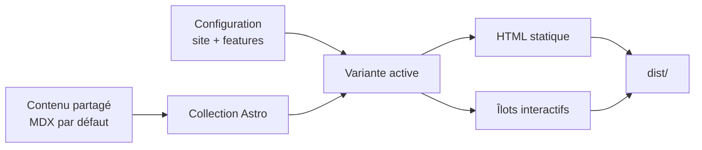

Lisible est un framework de blog statique construit avec Astro. Il réunit un cœur fonctionnel audité, six expériences visuelles interchangeables et une chaîne éditoriale bilingue. Le contenu reste unique : changer de variante ne duplique ni les articles ni la configuration.

:::tip[La promesse]
Un clone, une commande d’initialisation, puis un site rapide, accessible, indexable et prêt à être personnalisé.
:::

## Ce que Lisible fournit

- un rendu statique avec très peu de JavaScript côté lecteur ;
- six variantes visuelles partageant les mêmes contrats ;
- des contenus MDX par défaut en français et en anglais, avec tout Markdown inclus ;
- Pagefind, RSS, sitemap, OpenGraph, JSON-LD et exports texte ;
- des callouts, formules KaTeX, diagrammes Mermaid et draw.io en plein écran ;
- des arborescences, onglets, étapes et spoilers interactifs en MDX ;
- les tags, archives, séries, brouillons, couvertures et articles épinglés ;
- une navigation sans rechargement grâce aux transitions Astro ;
- un previewer en direct partageable et synchronisé sur un commit source exact ;
- des contrôles de qualité pour les liens, les assets et les builds.

## Modèle mental

Le dossier `shared/` possède les données communes. Le dossier `versions/<variante>/` possède le rendu. Les scripts racine choisissent la variante puis délèguent `dev`, `build` et `preview` au bon paquet.

## Parcours recommandé

1. Explorez le [preview en direct](/docs/features/live-preview/) pour comparer variantes et réglages.
2. Lisez [Architecture](/docs/discover/architecture/) pour savoir où placer chaque changement.
3. Suivez [Installation](/docs/getting-started/installation/) et [Configuration](/docs/getting-started/configuration/).
4. Consultez [Contenu](/docs/authoring/content/), [Markdown](/docs/authoring/markdown/) et [MDX](/docs/authoring/mdx/) avant de publier.
5. Activez ou désactivez les capacités dans `shared/features.ts`.
6. Terminez par [Qualité](/docs/operations/quality/), [Build et déploiement](/docs/operations/build-deploy/), puis [Dépannage](/docs/operations/troubleshooting/).

:::important[Documentation bilingue]
Chaque page française possède un miroir anglais au même emplacement logique. Les exemples de code restent identiques, tandis que les explications et libellés sont réellement traduits.
:::

## Périmètre

Lisible privilégie une édition Git simple. Il ne fournit pas de CMS, d’analytics ou de service d’email. Ces choix réduisent le coût initial et la surface de maintenance, tout en laissant la possibilité d’ajouter des intégrations au besoin.
