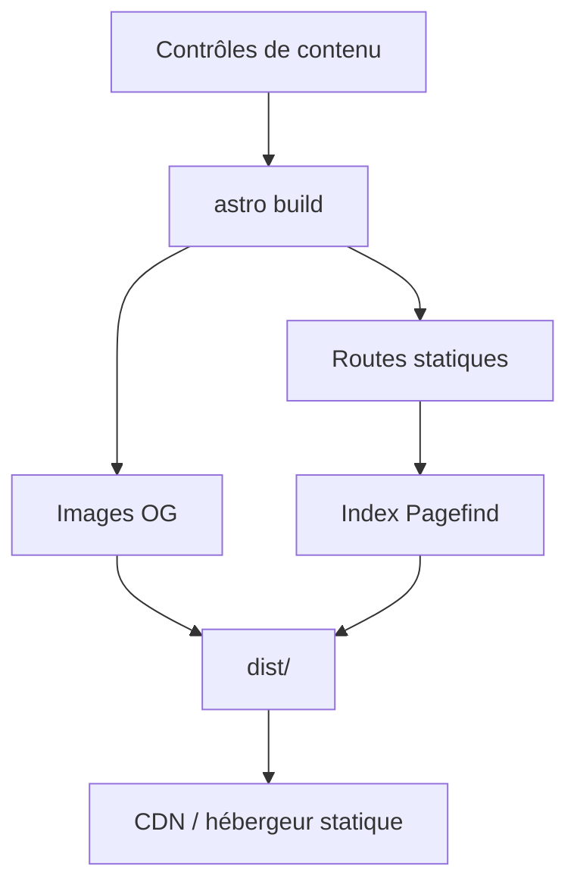

Lisible produit un dossier `dist/` autonome. Aucun serveur Node ou Bun n’est nécessaire pour servir la production : un hébergeur statique ou un CDN suffit.[^static-output]

## Build de référence

```bash
bun run build
```

La commande valide le contenu, génère les routes FR/EN, les images OpenGraph, le sitemap, les flux, les exports Markdown puis l’index Pagefind.



## Variables de production

Avant le build, vérifiez :

- `SITE.url` avec le domaine final ;
- le dépôt et la branche pour les liens d’édition ;
- les configurations publiques Giscus, Bluesky ou webmention.io ;
- les secrets injectés par l’environnement, jamais écrits dans le client ;
- la variante choisie dans `lisible.config.json`.

## Stratégies d’hébergement

| Plateforme | Sortie | Réécritures |
| --- | --- | --- |
| GitHub Pages | `dist/` | base path éventuel |
| Cloudflare Pages | `dist/` | aucune pour les routes générées |
| Netlify | `dist/` | page 404 statique |
| Vercel | `dist/` | projet statique |
| Nginx/Caddy | fichiers `dist/` | fallback 404, compression |

## Déploiement en un clic

Le README racine place côte à côte les boutons **Deploy with Vercel** et **Deploy to Netlify**. Tous deux clonent le dépôt public et sélectionnent `versions/organique` comme projet à construire ; les commandes et le dossier `dist/` sont préremplis, sans configuration manuelle dans le tableau de bord.

:::important[Ne publiez pas le dépôt entier]
L’artefact déployable est `dist/`. `node_modules`, `.astro`, caches de cartes et sources ne doivent pas être envoyés au serveur statique.
:::

## En-têtes recommandés

- cache long et immutable pour `/_astro/*` ;
- cache court pour HTML, RSS, sitemap et Pagefind ;
- `Content-Security-Policy` adaptée aux intégrations activées ;
- compression Brotli ou gzip ;
- `X-Content-Type-Options: nosniff` et politique de referrer.

## Recette après déploiement

1. Ouvrez une page FR et son miroir EN.
2. Vérifiez canonical, hreflang et image OG.
3. Testez <kbd>Ctrl</kbd>/<kbd>Cmd</kbd> + <kbd>K</kbd>.
4. Naviguez sans rechargement complet.
5. Ouvrez RSS, sitemap, `robots.txt` et `llms.txt`.
6. Contrôlez une 404 réelle.

La page [Qualité et accessibilité](/docs/operations/quality/) donne la checklist avant publication.

## Références

- [Guide de déploiement Astro](https://docs.astro.build/en/guides/deploy/)
- [Configuration du build Astro](https://docs.astro.build/en/reference/configuration-reference/#build-options)

[^static-output]: Le mode statique est le comportement par défaut d’Astro ; Lisible le fixe explicitement pour rendre l’artefact prévisible.
