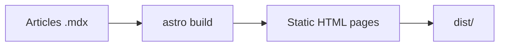

import { Tabs, Tab } from "@/components/ui/tabs";
import { Steps, Step } from "@/components/ui/steps";
import { Tree } from "@shared/components/ui/file-tree";
import Spoiler from "@/components/Spoiler.astro";

This post is the blog's showcase. It demonstrates every formatting option and every application feature. If something renders badly here, it's a bug in the theme, not in the content.

## Interactive File Tree

The shared component works in all six versions. Open folders, select a file or use the global control.

<Tree
  client:load
  initialExpandedItems={["src", "components"]}
  initialSelectedId="home"
  elements={[
    {
      id: "src",
      name: "src",
      type: "folder",
      children: [
        {
          id: "components",
          name: "components",
          type: "folder",
          children: [
            { id: "home", name: "HomePage.astro", type: "file" },
            { id: "card", name: "PostCard.astro", type: "file" },
          ],
        },
        { id: "styles", name: "styles.css", type: "file" },
      ],
    },
    { id: "config", name: "lisible.config.json", type: "file" },
    { id: "package", name: "package.json", type: "file" },
  ]}
/>

## Application features

What you can test directly on this page:

- [ ] The theme switcher in the header (dark by default, preference remembered)
- [ ] Full-text search with <kbd>Ctrl</kbd> + <kbd>K</kbd> (or <kbd>Cmd</kbd> + <kbd>K</kbd> on Mac)
- [ ] The table of contents on the right, with the active section highlighted as you scroll
- [ ] The reading progress bar at the top of the page
- [ ] The estimated reading time below the title
- [ ] The publication date and the last updated date
- [ ] Clickable tags leading to the filter pages
- [ ] Previous and next post navigation at the bottom of the page
- [ ] The back-to-top button after a bit of scrolling
- [ ] The generated [RSS](/en/rss.xml) feed, [sitemap](/sitemap-index.xml) and robots.txt
- [ ] Drafts hidden in production (look for "draft" in the list, it's not there)
- [ ] The FR/EN language switcher in the header: this article also exists [in French](/blog/demo-fonctionnalites)
- [ ] Navigation without any page reload: click any internal link, the transition is instant and the theme is preserved
- [ ] The GitHub repository card generated by the `::github` directive (see the Rich cards section)
- [ ] Link previews: a bare URL on its own line becomes an OpenGraph card (same section)
- [ ] The customizable accent color: palette button in the header, choice remembered across visits, reset button (the webmaster sets the default in the config)
- [ ] The fullscreen viewer: click any image in the article to open it as an overlay, zoom with the wheel, drag to pan and close with <kbd>Esc</kbd>
- [ ] Copyable heading anchors: hover a section heading, a link icon appears, clicking it copies the direct URL to that section
- [ ] The "Read next" block at the end of the article, with 2 or 3 posts related by tags
- [ ] Social share buttons and AI buttons ("Copy as Markdown", "Open in Claude", "Open in ChatGPT") at the end of the article
- [ ] The "Edit this page on GitHub" link at the bottom of the article, shown only if the repository is configured
- [ ] The interactive `Tabs`, `Steps` and `Spoiler` MDX components below, in all six variants
- [ ] Comment and webmention placeholders at the end of the post, with example Mastodon, Bluesky, GitHub and email profiles

## Interactive MDX components

MDX is Lisible's default article format. It keeps every Markdown feature demonstrated on this page and additionally allows typed, accessible components styled by each variant.

### Tabs

`Tabs` groups several versions of the same example. The tab list supports the keyboard, exposes the expected ARIA roles and hydrates only this interaction.

<Tabs tabs={["bun", "npm", "pnpm"]} label="Package manager" client:load>
<Tab>

```bash title="Bun"
bun install
bun run dev
```

</Tab>
<Tab>

```bash title="npm"
npm install
npm run dev
```

</Tab>
<Tab>

```bash title="pnpm"
pnpm install
pnpm dev
```

</Tab>
</Tabs>

### Steps

`Steps` renders an ordered journey without sacrificing the document's semantic structure.

<Steps>
<Step title="Create the post">

Run `bun run new-post my-post --translate`. The scaffolder now creates two `.mdx` files by default.

</Step>
<Step title="Compose">

Use Markdown, directives, footnotes, diagrams and MDX components in the same document.

</Step>
<Step title="Validate and publish">

Set `draft` to `false`, then run `bun run check:all` before deployment.

</Step>
</Steps>

### Hidden content

`Spoiler` reveals an answer on demand and remains keyboard accessible. Its content is present in the HTML, so it must never contain a secret.

<Spoiler>The demonstration answer is 42. Activate the component again to hide it.</Spoiler>

## Typography and emphasis

Text in **bold**, in *italics*, in ***bold italics***, some ~~strikethrough~~ text, some `inline code`, and a combination **with `code` inside**.

French characters render fine: à, é, è, ù, ç, œ, æ, guillemets "like this", and the typographic apostrophe is not broken.

An [internal link to the tags](/en/tags), an [external link to Astro](https://astro.build), and a bare autolinked URL: https://docs.astro.build

### Heading level three

Level three shows up in the table of contents, indented under its parent.

#### Heading level four

Level four does not appear in the table of contents: that's intentional, it stops at depth three.

## Lists

### Nested bullet list

- First item
- Second item
  - Sub-item with some `code`
  - Sub-item with a [link](https://astro.build)
    - Third level, for good measure
- Third item

### Ordered list

1. Install the dependencies
2. Start the development server
   1. Open the browser
   2. Check the dark theme
3. Write a post

### Task list

- [x] Standard Markdown
- [x] GFM extensions (tables, strikethrough, tasks, autolinks)
- [x] Math formulas (see the Math section)
- [x] Mermaid diagrams (see the Diagrams section)

## Blockquotes

> A simple quote, on a single line.

> A longer quote containing some **bold**, some `code` and a [link](https://astro.build).
>
> It spans multiple paragraphs.
>
> > And here is a nested quote inside the first one.

## Tables

Left, center and right alignment:

| Feature | Status | JS weight |
| :--- | :---: | ---: |
| Pagefind search | Active | lazy |
| Theme switcher | Active | < 1 KB |
| Table of contents | Active | ~2 KB |
| Comments | None | 0 KB |

A wide table to test horizontal scrolling on mobile:

| Directive | Hydration timing | Priority | Typical use case | Initial cost | Example |
| --- | --- | --- | --- | --- | --- |
| `client:load` | Immediate | High | Theme switcher, header | Paid upfront | `<Toggle client:load />` |
| `client:idle` | Browser idle | Medium | Search bar | Briefly deferred | `<Search client:idle />` |
| `client:visible` | Enters the viewport | Low | Footer carousel | Deferred longer | `<Carousel client:visible />` |
| `client:media` | Media query matches | Variable | Mobile-only menu | Conditional | `<Menu client:media="(max-width: 768px)" />` |

## Code

TypeScript with syntax highlighting:

```ts
import { getCollection } from "astro:content";

export async function getPublishedPosts() {
  const posts = await getCollection("blog");
  return posts
    .filter((post) => import.meta.env.DEV || !post.data.draft)
    .sort((a, b) => b.data.pubDate.valueOf() - a.data.pubDate.valueOf());
}
```

An Astro component:

```astro
---
import BaseLayout from "@/layouts/BaseLayout.astro";
const { title } = Astro.props;
---
<BaseLayout title={title}>
  <slot />
</BaseLayout>
```

CSS with the theme tokens:

```css
.dark {
  --background: oklch(0 0 0);
  --accent: oklch(0.723 0.219 149.6);
}
```

Shell:

```bash
bun install
bun run dev
bun run build && bun run preview
```

JSON:

```json
{
  "name": "blog",
  "scripts": { "dev": "astro dev", "build": "astro build" }
}
```

A diff:

```diff
- const theme = "light";
+ const theme = stored ?? "dark";
```

And a line that is deliberately far too long, to check line wrapping in code blocks, because a line that overflows with neither wrapping nor a scrollbar is the surest way to break a carefully built mobile layout.

```text
This line is deliberately interminable in order to test the word wrap behavior of the code block on narrow screens, especially phones in portrait mode where every horizontal pixel matters enormously.
```

Every block shows a built-in copy button, a language badge in the top right corner and line numbers (except for shell and plain text).

### Advanced blocks (Expressive Code)

A file title in an editor frame:

```ts title="src/lib/posts.ts"
import { getCollection } from "astro:content";

export async function getPublishedPosts() {
  const posts = await getCollection("blog");
  return posts.filter((post) => !post.data.draft);
}
```

Highlighted, inserted and deleted lines, plus a marked word:

```ts title="migration.ts" {2} del={"Removed":5} ins={"Added":6-7} "getPublishedPosts"
// Line 2 is highlighted, line 5 deleted, lines 6 and 7 inserted.
const highlighted = "I am emphasized";
const context = "nothing special here";
const call = getPublishedPosts();
const removed = "this line goes away";
const added = "this one arrives";
const bonus = "with its neighbor";
```

A terminal frame with a title:

```bash frame="terminal" title="Deployment"
bun run build
bun run preview
```

A collapsible section for long import preambles:

```ts collapse={1-6}
import { getCollection } from "astro:content";
import { readingTime } from "@/lib/utils";
import { t } from "@/i18n/ui";
import { SITE } from "@/site.config";
import type { CollectionEntry } from "astro:content";
// End of the preamble, collapsed by default.
export function visible() {
  return "the body of the file stays readable";
}
```

## Images


The alt attribute is mandatory and doubles as an implicit caption. The image must cause no layout shift while loading.

## Rich cards

### GitHub repository

The directive below becomes a repository card, hydrated client-side with public data from the GitHub API (description, stars, forks, language):

::github{repo="didntchooseaname/lisible"}

### Link preview

A bare URL sitting alone on its own line becomes a preview card, with the title, description and OpenGraph image fetched at build time:

https://astro.build

Inside a paragraph, the same link https://astro.build stays a regular link: only the isolated line triggers the card.

## Callouts

Callouts (also called admonitions) highlight a piece of information outside the flow of the text. Five semantic variants are available, each with its own token color and icon. One variant accepts a custom title in brackets, another collapses on click.

:::note
A neutral note, for extra information with no particular urgency.
:::

:::tip
A practical tip: dark mode is the default here, it is designed first.
:::

:::warning[Watch your dependencies]
A warning with a **custom title** in brackets. Make sure `bun outdated` is empty before publishing a new version.
:::

:::caution
Handle with care: changing the content schema can invalidate posts that are already written.
:::

:::important[Click to expand]{collapse}
This callout is **collapsible** thanks to the `{collapse}` marker: it opens on click, which is handy for secondary details or long reminders. Rich content works inside, with `code`, a [link](https://astro.build) and several lines of text.
:::

## Math

Math rendering goes through KaTeX (self-hosted, no CDN) and is only loaded on pages that actually contain formulas. Inline, Euler's identity links five fundamental constants, $e^{i\pi} + 1 = 0$, and a classic relation reads $a^2 + b^2 = c^2$.

As a block, the same Euler identity, highlighted and centered:

$$
e^{i\pi} + 1 = 0
$$

And the sum of the first $n$ natural numbers:

$$
\sum_{k=1}^{n} k = \frac{n(n+1)}{2}
$$

## Diagrams

### Mermaid

`mermaid` code blocks are rendered client-side with lazy loading, pan and zoom, and re-tint automatically when the theme changes (falling back to the source code if rendering fails). Here is the publishing pipeline, from the article files down to the `dist` folder:



### draw.io

draw.io diagrams (`.drawio` files or exported SVG) are rendered by an interactive viewer component, lazy-loaded, with zoom and panning, and a background that follows the active theme live. The image placed inside the directive acts as a static fallback: it is shown as-is if the viewer is not available.

:::drawio{src="/images/demo-ilots.svg" title="Islands pipeline"}

:::

## Collapsible details

<details>
<summary>Click to expand this section</summary>

Raw HTML works in Markdown. This `details` block is handy for long asides, exercise solutions or verbose logs.

```bash
echo "even code inside"
```

</details>

## Footnotes

Footnotes[^1] point to the end of the article, with a back link[^2].

[^1]: Here is the first note, with a [link](https://docs.astro.build) inside.

[^2]: And the second one, to check the numbering.

## Divider

A horizontal rule below closes out this demonstration.

---

End of the tour. If everything above renders cleanly in both themes, on mobile as well as on desktop, the blog keeps its promise.
