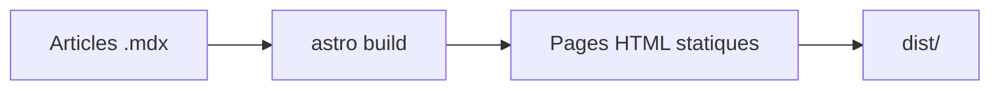

import { Tabs, Tab } from "@/components/ui/tabs";
import { Steps, Step } from "@/components/ui/steps";
import { Tree } from "@shared/components/ui/file-tree";
import Spoiler from "@/components/Spoiler.astro";

Cet article est la vitrine du blog. Il montre chaque possibilité de formatage et chaque fonctionnalité de l'application. Si quelque chose rend mal ici, c'est un bug du thème, pas du contenu.

## File Tree interactif

Le composant partagé fonctionne dans les six versions. Ouvrez les dossiers, sélectionnez un fichier ou utilisez le contrôle global.

<Tree
  client:load
  initialExpandedItems={["src", "components"]}
  initialSelectedId="home"
  elements={[
    {
      id: "src",
      name: "src",
      type: "folder",
      children: [
        {
          id: "components",
          name: "components",
          type: "folder",
          children: [
            { id: "home", name: "HomePage.astro", type: "file" },
            { id: "card", name: "PostCard.astro", type: "file" },
          ],
        },
        { id: "styles", name: "styles.css", type: "file" },
      ],
    },
    { id: "config", name: "lisible.config.json", type: "file" },
    { id: "package", name: "package.json", type: "file" },
  ]}
/>

## Fonctionnalités de l'application

Ce que vous pouvez tester directement sur cette page:

- [ ] Le switcher de thème dans le header (dark par défaut, préférence mémorisée)
- [ ] La recherche plein texte avec <kbd>Ctrl</kbd> + <kbd>K</kbd> (ou <kbd>Cmd</kbd> + <kbd>K</kbd> sur Mac)
- [ ] La table des matières à droite, avec surlignage de la section active au scroll
- [ ] La barre de progression de lecture en haut de page
- [ ] Le temps de lecture estimé sous le titre
- [ ] La date de publication et la date de mise à jour
- [ ] Les tags cliquables, qui mènent aux pages de filtrage
- [ ] La navigation article précédent et suivant en bas de page
- [ ] Le bouton retour en haut après un peu de scroll
- [ ] Le flux [RSS](/rss.xml), le [sitemap](/sitemap-index.xml) et le robots.txt générés
- [ ] Les brouillons invisibles en production (cherchez « brouillon » dans la liste, il n'y est pas)
- [ ] Le sélecteur de langue FR/EN dans le header: cet article existe aussi [en anglais](/en/blog/demo-fonctionnalites)
- [ ] La navigation sans aucun rechargement de page: cliquez n'importe quel lien interne, la transition est instantanée et le thème est conservé
- [ ] La carte de dépôt GitHub générée par la directive `::github` (voir la section Cartes enrichies)
- [ ] L'aperçu de lien: une URL nue sur sa propre ligne devient une carte OpenGraph (même section)
- [ ] La couleur d'accent personnalisable: bouton palette dans le header, choix mémorisé entre les visites, bouton réinitialiser (le défaut est fixé par le webmaster dans la config)
- [ ] La visionneuse plein écran: cliquez n'importe quelle image de l'article pour l'ouvrir en overlay, zoomer à la molette, déplacer au glisser et fermer avec <kbd>Échap</kbd>
- [ ] Les ancres de titres copiables: survolez un titre de section, une icône lien apparaît, le clic copie l'URL directe vers cette section
- [ ] Le bloc « À lire ensuite » en fin d'article, avec 2 ou 3 articles proches par tags
- [ ] Les boutons de partage social et les boutons IA (« Copier en Markdown », « Ouvrir dans Claude », « Ouvrir dans ChatGPT ») en fin d'article
- [ ] Le lien « Modifier cette page sur GitHub » en bas d'article, affiché uniquement si le dépôt est configuré
- [ ] Les composants MDX interactifs `Tabs`, `Steps` et `Spoiler` ci-dessous, dans les six variantes
- [ ] Les placeholders de commentaires et webmentions en fin d’article, avec profils Mastodon, Bluesky, GitHub et emails d’exemple

## Composants MDX interactifs

MDX est le format d’article par défaut de Lisible. Il conserve toute la syntaxe Markdown présentée dans cette page et autorise en plus des composants typés, accessibles et stylés par chaque variante.

### Onglets

`Tabs` regroupe plusieurs versions d’un même exemple. La liste des onglets accepte le clavier, expose les rôles ARIA attendus et n’hydrate que cette interaction.

<Tabs tabs={["bun", "npm", "pnpm"]} label="Gestionnaire de paquets" client:load>
<Tab>

```bash title="Bun"
bun install
bun run dev
```

</Tab>
<Tab>

```bash title="npm"
npm install
npm run dev
```

</Tab>
<Tab>

```bash title="pnpm"
pnpm install
pnpm dev
```

</Tab>
</Tabs>

### Étapes

`Steps` rend un parcours ordonné sans sacrifier la structure sémantique du document.

<Steps>
<Step title="Créer l’article">

Lancez `bun run new-post mon-article --translate`. Le générateur crée désormais deux fichiers `.mdx` par défaut.

</Step>
<Step title="Composer">

Utilisez Markdown, les directives, les notes, les diagrammes et les composants MDX dans le même document.

</Step>
<Step title="Valider et publier">

Passez `draft` à `false`, puis exécutez `bun run check:all` avant le déploiement.

</Step>
</Steps>

### Contenu masqué

`Spoiler` révèle une réponse à la demande et reste utilisable au clavier. Le contenu est présent dans le HTML : il ne faut donc jamais y placer un secret.

<Spoiler>La réponse de démonstration est 42. Activez de nouveau le composant pour la masquer.</Spoiler>

## Typographie et emphase

Du texte en **gras**, en *italique*, en ***gras italique***, du texte ~~barré~~, du `code inline`, et une combinaison **avec du `code` dedans**.

Les caractères français passent bien: à, é, è, ù, ç, œ, æ, les guillemets « comme ceci », et l'apostrophe typographique n'est pas cassée.

Un [lien interne vers les tags](/tags), un [lien externe vers Astro](https://astro.build), et une URL brute autoliée: https://docs.astro.build

### Niveau trois de titre

Le niveau trois apparaît dans la table des matières, indenté sous son parent.

#### Niveau quatre de titre

Le niveau quatre n'apparaît pas dans la table des matières: c'est voulu, elle s'arrête à la profondeur trois.

## Listes

### Liste à puces imbriquée

- Premier élément
- Deuxième élément
  - Sous-élément avec du `code`
  - Sous-élément avec un [lien](https://astro.build)
    - Troisième niveau, pour la route
- Troisième élément

### Liste ordonnée

1. Installer les dépendances
2. Lancer le serveur de développement
   1. Ouvrir le navigateur
   2. Vérifier le thème sombre
3. Écrire un article

### Liste de tâches

- [x] Markdown standard
- [x] Extensions GFM (tableaux, barré, tâches, autoliens)
- [x] Formules mathématiques (voir la section Mathématiques)
- [x] Diagrammes Mermaid (voir la section Diagrammes)

## Citations

> Une citation simple, sur une seule ligne.

> Une citation plus longue qui contient du **gras**, du `code` et un [lien](https://astro.build).
>
> Elle s'étend sur plusieurs paragraphes.
>
> > Et voici une citation imbriquée à l'intérieur de la première.

## Tableaux

Alignements gauche, centre et droite:

| Fonctionnalité | Statut | Poids JS |
| :--- | :---: | ---: |
| Recherche Pagefind | Actif | lazy |
| Switcher de thème | Actif | < 1 ko |
| Table des matières | Actif | ~2 ko |
| Commentaires | Absent | 0 ko |

Un tableau large pour tester le défilement horizontal sur mobile:

| Directive | Moment d'hydratation | Priorité | Cas d'usage typique | Coût initial | Exemple |
| --- | --- | --- | --- | --- | --- |
| `client:load` | Immédiat | Haute | Switcher de thème, header | Payé tout de suite | `<Toggle client:load />` |
| `client:idle` | Navigateur inactif | Moyenne | Barre de recherche | Différé court | `<Search client:idle />` |
| `client:visible` | Entrée dans le viewport | Basse | Carrousel en pied de page | Différé long | `<Carousel client:visible />` |
| `client:media` | Media query satisfaite | Variable | Menu mobile uniquement | Conditionnel | `<Menu client:media="(max-width: 768px)" />` |

## Code

Du TypeScript avec mise en évidence:

```ts
import { getCollection } from "astro:content";

export async function getPublishedPosts() {
  const posts = await getCollection("blog");
  return posts
    .filter((post) => import.meta.env.DEV || !post.data.draft)
    .sort((a, b) => b.data.pubDate.valueOf() - a.data.pubDate.valueOf());
}
```

Un composant Astro:

```astro
---
import BaseLayout from "@/layouts/BaseLayout.astro";
const { title } = Astro.props;
---
<BaseLayout title={title}>
  <slot />
</BaseLayout>
```

Du CSS avec les tokens du thème:

```css
.dark {
  --background: oklch(0 0 0);
  --accent: oklch(0.723 0.219 149.6);
}
```

Du shell:

```bash
bun install
bun run dev
bun run build && bun run preview
```

Du JSON:

```json
{
  "name": "blog",
  "scripts": { "dev": "astro dev", "build": "astro build" }
}
```

Un diff:

```diff
- const theme = "light";
+ const theme = stored ?? "dark";
```

Et une ligne volontairement trop longue pour vérifier le retour à la ligne dans les blocs de code, parce qu'une ligne qui déborde sans wrap ni scrollbar est le plus sûr moyen de casser une mise en page mobile soigneusement construite.

```text
Cette ligne est délibérément interminable afin de tester le comportement de word wrap du bloc de code sur les écrans étroits, notamment les téléphones en mode portrait où chaque pixel horizontal compte énormément.
```

Chaque bloc affiche un bouton copier intégré, un badge de langue en haut à droite et des numéros de ligne (sauf pour le shell et le texte brut).

### Blocs avancés (Expressive Code)

Un titre de fichier dans un cadre éditeur:

```ts title="src/lib/posts.ts"
import { getCollection } from "astro:content";

export async function getPublishedPosts() {
  const posts = await getCollection("blog");
  return posts.filter((post) => !post.data.draft);
}
```

Des lignes surlignées, ajoutées et supprimées, plus un mot marqué:

```ts title="migration.ts" {2} del={"Supprimé":5} ins={"Ajouté":6-7} "getPublishedPosts"
// La ligne 2 est surlignée, la 5 supprimée, les 6 et 7 ajoutées.
const surlignée = "je suis mise en évidence";
const contexte = "rien de spécial ici";
const appel = getPublishedPosts();
const supprimée = "cette ligne part";
const ajoutée = "celle-ci arrive";
const bonus = "avec sa voisine";
```

Un cadre terminal avec titre:

```bash frame="terminal" title="Déploiement"
bun run build
bun run preview
```

Une section repliable pour les longs préambules d'imports:

```ts collapse={1-6}
import { getCollection } from "astro:content";
import { readingTime } from "@/lib/utils";
import { t } from "@/i18n/ui";
import { SITE } from "@/site.config";
import type { CollectionEntry } from "astro:content";
// Fin du préambule replié par défaut.
export function visible() {
  return "le corps du fichier reste lisible";
}
```

## Images


L'attribut alt est obligatoire et sert de légende implicite. L'image ne doit provoquer aucun décalage de mise en page au chargement.

## Cartes enrichies

### Dépôt GitHub

La directive ci-dessous devient une carte de dépôt, hydratée côté client avec les données publiques de l'API GitHub (description, étoiles, forks, langage):

::github{repo="didntchooseaname/lisible"}

### Aperçu de lien

Une URL nue posée seule sur sa ligne devient une carte d'aperçu, avec le titre, la description et l'image OpenGraph récupérés au build:

https://astro.build

Dans un paragraphe, le même lien https://astro.build reste un lien normal: seule la ligne isolée déclenche la carte.

## Callouts

Les callouts (aussi appelés admonitions) mettent en valeur une information hors du fil du texte. Cinq variantes sémantiques sont disponibles, chacune avec sa couleur de token et son icône. Une variante accepte un titre personnalisé entre crochets, une autre se replie au clic.

:::note
Une note neutre, pour un complément d'information sans caractère d'urgence.
:::

:::tip
Un conseil pratique: le mode sombre est le mode par défaut ici, il est pensé en premier.
:::

:::warning[Attention aux dépendances]
Une mise en garde avec un **titre personnalisé** entre crochets. Vérifiez que `bun outdated` est vide avant de publier une nouvelle version.
:::

:::caution
À manier avec précaution: modifier le schéma de contenu peut invalider des articles déjà écrits.
:::

:::important[À déplier]{collapse}
Ce callout est **repliable** grâce au marqueur `{collapse}`: il s'ouvre au clic, ce qui est pratique pour les détails secondaires ou les rappels longs. Le contenu riche fonctionne à l'intérieur, avec du `code`, un [lien](https://astro.build) et plusieurs lignes de texte.
:::

## Mathématiques

Le rendu mathématique passe par KaTeX (self-hosted, sans CDN) et n'est chargé que sur les pages qui contiennent réellement des formules. En ligne, l'identité d'Euler relie cinq constantes fondamentales, $e^{i\pi} + 1 = 0$, et une relation classique s'écrit $a^2 + b^2 = c^2$.

En bloc, la même identité d'Euler, mise en valeur et centrée:

$$
e^{i\pi} + 1 = 0
$$

Et la somme des $n$ premiers entiers naturels:

$$
\sum_{k=1}^{n} k = \frac{n(n+1)}{2}
$$

## Diagrammes

### Mermaid

Les blocs de code `mermaid` sont rendus côté client en chargement différé, avec pan et zoom, et se re-teintent automatiquement au changement de thème (avec repli sur le code source si le rendu échoue). Voici le pipeline de publication, des fichiers d'articles jusqu'au dossier `dist`:



### draw.io

Les diagrammes draw.io (fichiers `.drawio` ou SVG exportés) sont rendus par un composant de visionneuse interactive, chargé en différé, avec zoom et déplacement, et dont le fond suit le thème actif en direct. L'image placée à l'intérieur de la directive sert de repli statique: elle s'affiche telle quelle si la visionneuse n'est pas disponible.

:::drawio{src="/images/demo-ilots.svg" title="Pipeline en îlots"}

:::

## Détails repliables

<details>
<summary>Cliquez pour déplier cette section</summary>

Le HTML brut fonctionne dans le Markdown. Ce bloc `details` est utile pour les apartés longs, les solutions d'exercices ou les logs verbeux.

```bash
echo "même du code à l'intérieur"
```

</details>

## Notes de bas de page

Les notes de bas de page[^1] renvoient en fin d'article, avec un lien de retour[^2].

[^1]: Voici la première note, avec un [lien](https://docs.astro.build) dedans.

[^2]: Et la seconde, pour vérifier la numérotation.

## Séparateur

Un séparateur horizontal ci-dessous clôt cette démonstration.

---

Fin de la visite. Si tout ce qui précède s'affiche proprement dans les deux thèmes, sur mobile comme sur desktop, le blog tient sa promesse.
